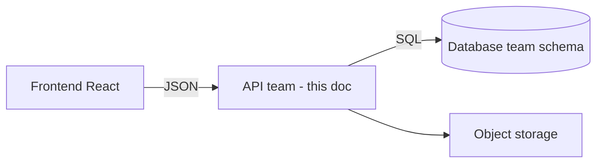
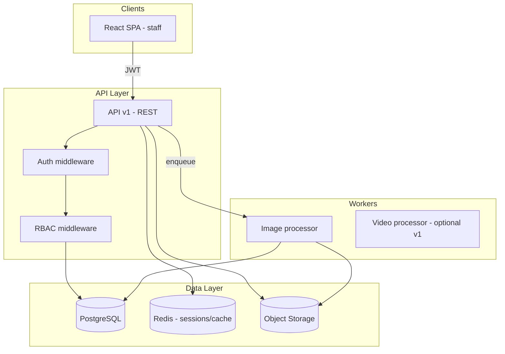
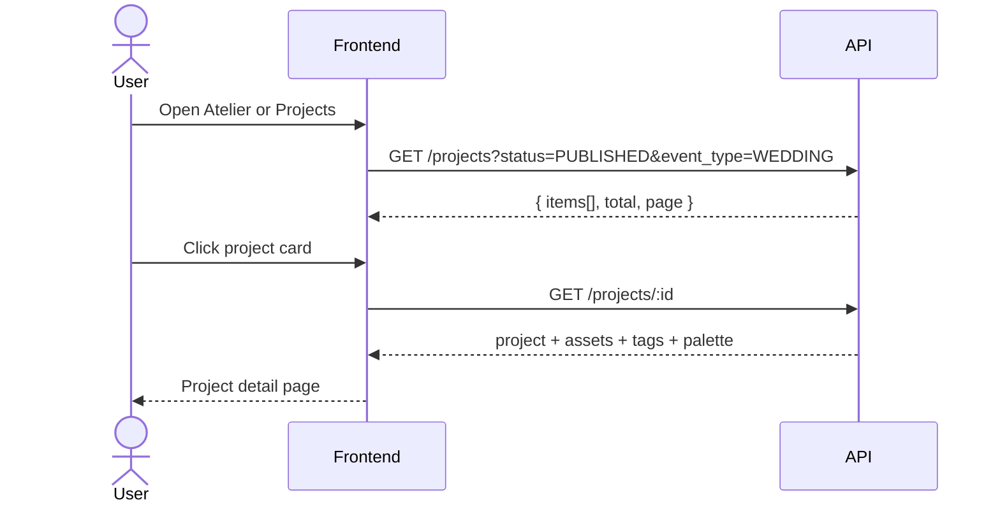
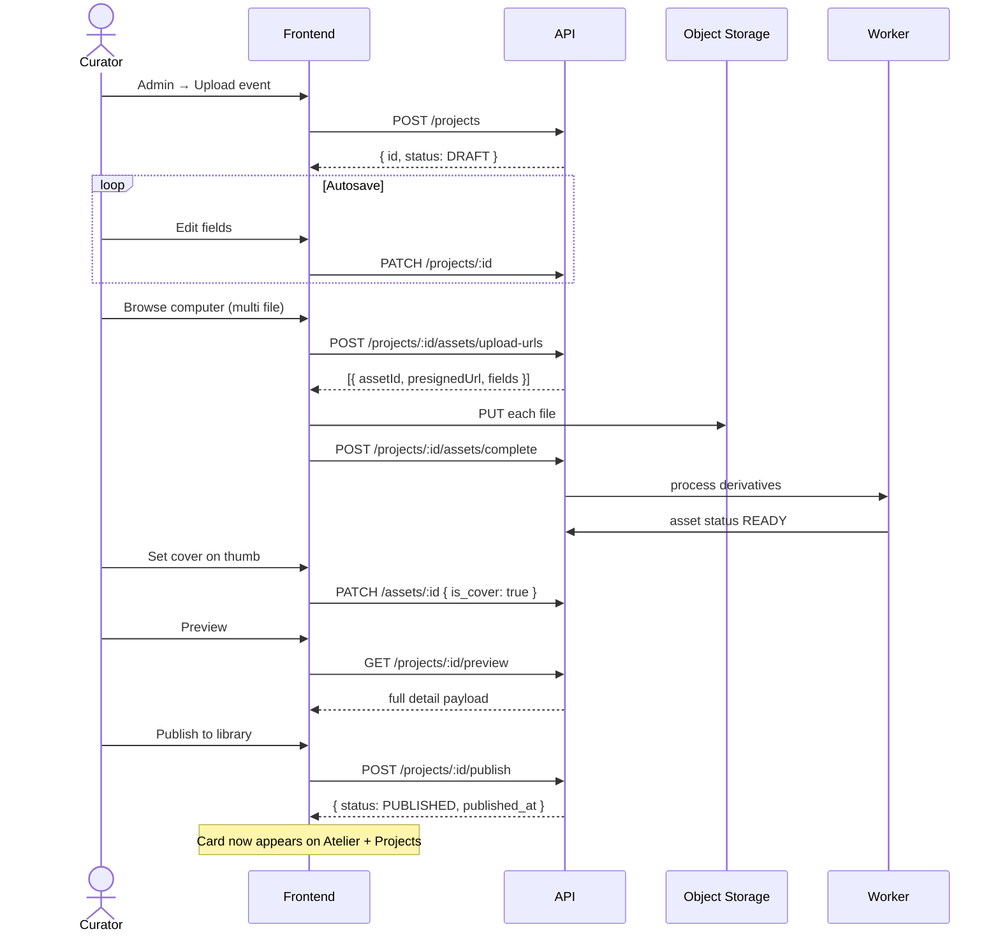
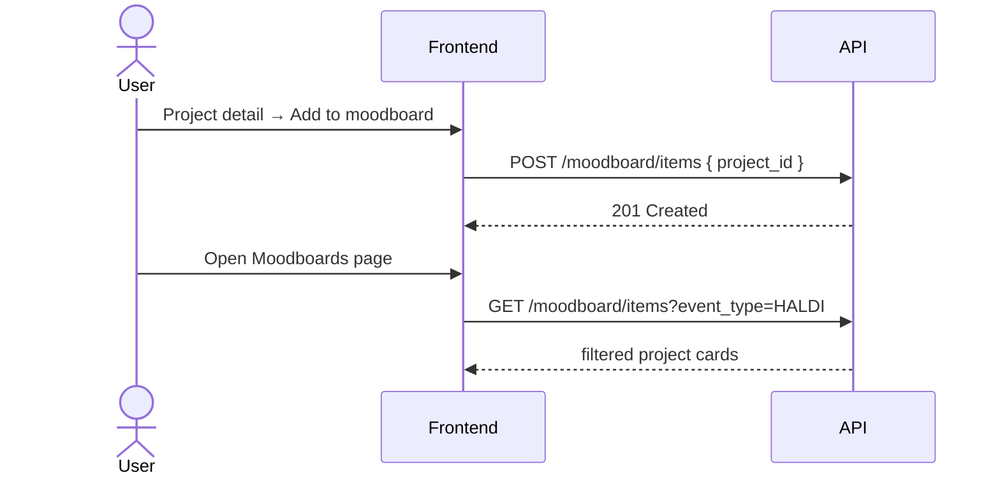
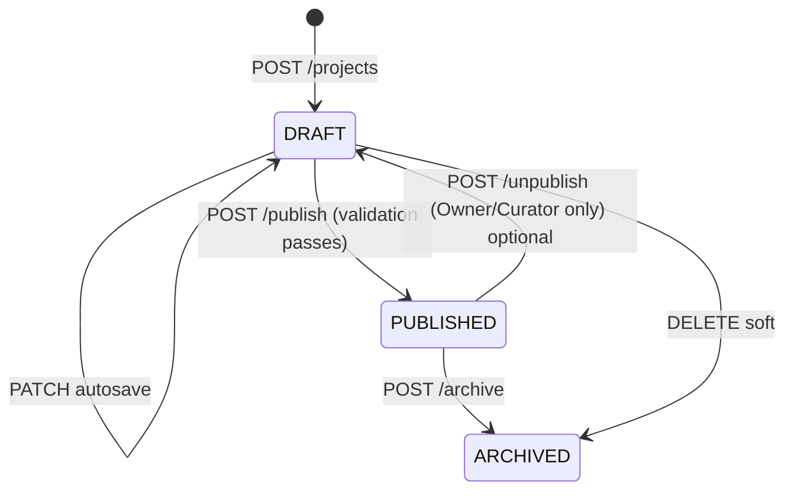

# Revaah Decor Atelier — Backend API Specification

**Version:** 3.0  
**Date:** 26 May 2026  
**Audience:** **Backend / API application team** (and frontend for integration)  
**Frontend repo:** `revaah project frontend`  
**Database schema (separate doc):** [`DATABASE_SCHEMA_SPEC.md`](./DATABASE_SCHEMA_SPEC.md) — **not owned by API team**  
**Reference:** `BACKEND_REQUIREMENTS.md` (share links, AI — future)

---

## How to use this document

| Section | Contents |
|---------|----------|
| [§0](#0-related-documents--teams) | Related docs, team split |
| [§0.1](#01-frontend-technology-stack) | Frontend stack (for API contract alignment) |
| §1–3 | Product context, architecture |
| §4–15 | **API modules** — auth, projects, upload, publish, listings, moodboards, search |
| §16 | **REST API reference** (endpoints) |
| §17–22 | RBAC, security, NFRs, phases, payloads |

**This document does not define database tables or migrations.** Use [`DATABASE_SCHEMA_SPEC.md`](./DATABASE_SCHEMA_SPEC.md).

**Frontend today:** UI prototype only. No live API calls yet.

---

## Table of contents

0. [Team ownership & responsibilities](#0-team-ownership--responsibilities)  
0.1. [Frontend technology stack](#01-frontend-technology-stack)  
1. [Executive summary](#1-executive-summary)  
2. [Confirmed product requirements](#2-confirmed-product-requirements)  
3. [System architecture](#3-system-architecture)  
4. [User journeys](#4-user-journeys)  
5. [Module: Authentication](#5-module-authentication)  
6. [Module: Projects (CRUD & publish)](#6-module-projects-crud--publish)  
7. [Module: Media upload & cover image](#7-module-media-upload--cover-image)  
8. [Module: Library listings (Atelier & Projects)](#8-module-library-listings-atelier--projects)  
9. [Module: Project detail](#9-module-project-detail)  
10. [Module: Moodboards](#10-module-moodboards)  
11. [Module: Filters & event types](#11-module-filters--event-types)  
12. [Module: Team & organisation](#12-module-team--organisation)  
13. [Module: Search](#13-module-search)  
14. [Module: Taxonomies](#14-module-taxonomies)  
15. [Deferred: Client share links](#15-deferred-client-share-links)  
16. [REST API reference](#16-rest-api-reference)  
17. [RBAC & permissions](#17-rbac--permissions)  
18. [Security](#18-security)  
19. [Non-functional requirements](#19-non-functional-requirements)  
20. [Delivery phases & acceptance criteria](#20-delivery-phases--acceptance-criteria)  
21. [Open questions](#21-open-questions)  
22. [Appendix: payloads & enums](#22-appendix-payloads--enums)

---

## 0. Related documents & teams

| Document | Owner | Contents |
|----------|--------|----------|
| **This file** (`BACKEND_API_SPEC.md`) | **Backend / API team** | REST endpoints, auth, business logic, upload/publish, RBAC |
| [`DATABASE_SCHEMA_SPEC.md`](./DATABASE_SCHEMA_SPEC.md) | **Database team** | Tables, migrations, indexes, ER diagram — **separate** |
| [`BACKEND_REQUIREMENTS.md`](./BACKEND_REQUIREMENTS.md) | Reference | Share links, AI (future phases) |



**API team owns:** HTTP layer, validation, JWT, presigned URLs, workers, integration with DB via ORM/SQL.  
**API team does not own:** `CREATE TABLE`, migrations, or index design — coordinate with database team using their doc.

**Handoff:** Database team delivers staging `DATABASE_URL` + applied migrations → API team connects and implements §16 endpoints.

---

## 0.1 Frontend technology stack

The Atelier UI is built and maintained by the **frontend team** in this repository. Backend and DB teams should use this section to understand how the client will call APIs and what is already built in the UI.

### Core stack

| Layer | Technology | Version (approx.) | Notes |
|-------|------------|-------------------|--------|
| Runtime | Node.js | 18+ | For dev/build only; production is static assets |
| Build tool | **Vite** | 5.4.x | Dev server, HMR, production bundle |
| UI library | **React** | 18.3.x | SPA, no Next.js |
| Language | **TypeScript** | 5.6.x | Strict mode, project references |
| Styling | **Tailwind CSS** | 3.4.x | Utility classes + design tokens in `tailwind.config.ts` |
| CSS (custom) | Plain CSS | — | `src/styles/atelier.css` — full mockup styles (serif layout, wine/gold palette) |
| PostCSS | autoprefixer | 10.x | Via `postcss.config.cjs` |
| Lint | ESLint | 9.x | `npm run lint` |
| Typecheck | `tsc -b` | — | `npm run typecheck` |

**Not in use yet (can be added for API integration):** React Router, axios/React Query, Zustand/Redux. Navigation is currently **in-app state** (`useAtelier` hook), not URL routes — routing should be added when APIs go live.

### Repository layout

```
revaah project frontend/
├── index.html                 # Entry HTML, Google Fonts (Cormorant Garamond, Inter)
├── package.json
├── vite.config.ts
├── tsconfig.json
├── tailwind.config.ts
├── docs/
│   ├── BACKEND_ENGINEERING_SPEC.md   ← this file
│   └── BACKEND_REQUIREMENTS.md
├── legacy/
│   └── index.html             # Original single-file mockup (reference)
└── src/
    ├── main.tsx               # React bootstrap
    ├── App.tsx                # View switcher + modals
    ├── vite-env.d.ts
    ├── hooks/
    │   └── useAtelier.ts      # View state, login mock, modals
    ├── lib/
    │   └── atelier.ts         # Types, static GALLERY_CARDS (to replace with API)
    ├── styles/
    │   ├── tailwind.css
    │   └── atelier.css
    └── components/
        ├── DemoBar.tsx        # Dev-only view switcher (remove in prod)
        ├── layout/
        │   ├── TopBar.tsx     # Nav: Atelier, Projects, Moodboards, Admin
        │   └── AdminSidebar.tsx
        ├── modals/
        │   ├── ShareModal.tsx
        │   └── InviteModal.tsx
        └── views/
            ├── LoginView.tsx
            ├── LibraryView.tsx    # Atelier home (hero + grid)
            ├── ProjectView.tsx    # Project detail
            ├── UploadView.tsx     # Admin upload event
            ├── TeamView.tsx
            └── ClientView.tsx     # Client share preview (deferred backend)
```

### NPM scripts (frontend)

| Command | Purpose |
|---------|---------|
| `npm run dev` | Local dev server (default `http://localhost:5173`) |
| `npm run build` | Production build → `dist/` |
| `npm run preview` | Serve `dist/` locally |
| `npm run lint` | ESLint |
| `npm run typecheck` | TypeScript build |

### Frontend pages vs planned routes

| UI page (nav) | Component | Planned route | API dependency |
|---------------|-----------|---------------|----------------|
| Login | `LoginView` | `/login` | `POST /auth/login` |
| Atelier | `LibraryView` | `/atelier` | `GET /projects`, `GET /projects/stats` |
| Projects | *to split from Library* | `/projects` | Same `GET /projects` (no hero in UI) |
| Project detail | `ProjectView` | `/projects/:id` | `GET /projects/:id` |
| Moodboards | *not built* | `/moodboards` | `GET /moodboard/items` |
| Admin → Upload | `UploadView` | `/admin/projects/new` | Project + asset APIs |
| Team | `TeamView` | `/admin/team` | Team APIs |
| Client view | `ClientView` | `/c/:token` | Deferred (public API) |

### Environment variables (frontend — to add)

```bash
# .env.example (frontend team will add)
VITE_API_BASE_URL=https://api.staging.atelier.revaahdecor.in/v1
VITE_APP_ENV=development
```

### How frontend will integrate with API (contract)

| Concern | Frontend approach |
|---------|-------------------|
| Auth | Store `access_token` in memory or httpOnly cookie (prefer cookie if API sets it); attach `Authorization: Bearer` on staff routes |
| List/grid | Replace `GALLERY_CARDS` in `lib/atelier.ts` with `GET /projects` response |
| Upload | `<input type="file" multiple>` → `POST upload-urls` → PUT to S3 → `POST complete` → poll asset status |
| Cover | Click thumb → `PATCH /assets/:id` `{ is_cover: true }` |
| Publish | Button → `POST /projects/:id/publish` → redirect to project detail |
| Moodboard | Toggle → `POST/DELETE /moodboard/items` |
| Errors | Show API `error.message` / field errors in form |

### Fonts & branding (UI only)

- **Serif:** Cormorant Garamond — headings, brand  
- **Sans:** Inter — body, labels  
- **Colors:** ivory `#FAF6F0`, wine `#5C1A2B`, gold `#B8893A` (see `tailwind.config.ts` and `atelier.css`)

### Reference for API/DB teams

- **UI behaviour and fields:** `src/components/views/UploadView.tsx`, `ProjectView.tsx`, `LibraryView.tsx`  
- **Static sample data (shape reference):** `src/lib/atelier.ts`  
- **Full HTML mockup:** `legacy/index.html`

---

## 1. Executive summary

**Revaah Decor Atelier** is an internal **wedding decor portfolio** platform. Staff log in, browse published projects, filter by event type, open project details with full galleries, and (for curators) create projects via Admin → Upload event. Published projects appear on **Atelier** and **Projects** pages. Users can save projects to a personal **Moodboard**.

| Item | Decision |
|------|----------|
| Backend required? | **Yes** — mandatory for production |
| API style | REST JSON + **presigned direct upload** to object storage |
| Multi-page library | **Atelier** and **Projects** use the **same project list API**; Atelier additionally needs **stats** for hero |
| Publish rule | Only `status = PUBLISHED` projects appear on Atelier / Projects / Moodboard grids |
| Share links | **Out of scope for v1** — product will decide later |
| Scale (from UI) | ~412 projects, ~24k assets; batches up to **600 files**, **200 MB/file** |

---

## 2. Confirmed product requirements

These rules were confirmed with product/frontend stakeholders and **must** be implemented.

### 2.1 Navigation pages vs backend

| Frontend page | UI content | Backend responsibility |
|---------------|------------|------------------------|
| **Atelier** | Hero (stats + copy) + **filters** + project grid + curated collections | `GET /projects?status=PUBLISHED`, `GET /projects/stats`, optional collections API |
| **Projects** | **Filters + grid only** (no hero) | **Same** `GET /projects?status=PUBLISHED` as Atelier |
| **Project detail** | Hero, metadata, tags, palette, gallery, actions | `GET /projects/:id` + assets |
| **Admin → Upload event** | Form + file picker + cover + draft/preview/publish | Full project + asset APIs |
| **Moodboards** | Filters + grid of **user-saved** projects | Moodboard CRUD + filtered list |
| **Shared links** | Nav exists in UI | **Deferred** — do not block v1 on this |

### 2.2 Atelier vs Projects (critical)

```
┌──────────────────────────────────────────────────────────────┐
│  ATELIER (/atelier)                                          │
│  ┌────────────────────────────────────────────────────────┐  │
│  │ HERO: headline, description, stats (412 projects, …)   │  │  ← Frontend only layout
│  └────────────────────────────────────────────────────────┘  │
│  ┌────────────────────────────────────────────────────────┐  │
│  │ FILTERS: All | Wedding | Sangeet | Mehendi | Haldi …   │  │  ← Same API query params
│  └────────────────────────────────────────────────────────┘  │
│  ┌────────────────────────────────────────────────────────┐  │
│  │ PROJECT GRID (cards)                                   │  │
│  └────────────────────────────────────────────────────────┘  │
│  Optional: Curated collections strip                         │
└──────────────────────────────────────────────────────────────┘

┌──────────────────────────────────────────────────────────────┐
│  PROJECTS (/projects)                                        │
│  ┌────────────────────────────────────────────────────────┐  │
│  │ FILTERS (identical behaviour)                          │  │
│  └────────────────────────────────────────────────────────┘  │
│  ┌────────────────────────────────────────────────────────┐  │
│  │ PROJECT GRID (same card shape, same API)               │  │
│  └────────────────────────────────────────────────────────┘  │
│  NO hero section                                             │
└──────────────────────────────────────────────────────────────┘
```

**Backend rule:** One list endpoint serves both pages. Do **not** build separate “atelier” vs “projects” resources.

### 2.3 Admin upload flow (must implement)

| Step | User action | Backend behaviour |
|------|-------------|-------------------|
| 1 | Open Admin → Upload event | `POST /projects` → create `DRAFT` |
| 2 | Fill project details | `PATCH /projects/:id` (autosave every ~4s from UI) |
| 3 | Browse from computer / drop folder | Presigned upload URLs → store files → processing queue |
| 4 | Select **cover** image | `PATCH /assets/:id` with `is_cover: true` (clears other covers on project) |
| 5 | Save draft | `PATCH` and/or explicit `status: DRAFT` |
| 6 | Preview | `GET /projects/:id/preview` — staff auth; returns same shape as published detail |
| 7 | Publish to library | `POST /projects/:id/publish` → `PUBLISHED`, `published_at` set |
| 8 | After publish | Project included in `GET /projects?status=PUBLISHED` → visible on **Atelier** and **Projects** |

### 2.4 Filters

| Filter chip | Query parameter | Logic |
|-------------|---------------|--------|
| All | omit `event_type` | All published projects user can see |
| Wedding | `event_type=WEDDING` | Projects where `event_types` contains `WEDDING` |
| Sangeet | `event_type=SANGEET` | Same pattern |
| Mehendi | `event_type=MEHENDI` | |
| Haldi | `event_type=HALDI` | |
| Reception | `event_type=RECEPTION` | |
| Engagement | `event_type=ENGAGEMENT` | |

A project may have **multiple** event types (e.g. Wedding + Mehendi + Sangeet). Filtering uses **OR** semantics: if any type matches, include the project.

### 2.5 Moodboards

| Rule | Detail |
|------|--------|
| Who | Per **authenticated user** |
| Add | From project detail: “Add to moodboard” → `POST /moodboard/items` |
| Page | Moodboards nav → filters + grid (same card model as Projects) |
| Remove | `DELETE /moodboard/items/:projectId` (or toggle) |
| Scope | Only **published** projects can be added (return 400 if draft) |

### 2.6 Publish visibility

| Status | Visible on Atelier | Visible on Projects | Visible on Moodboard add |
|--------|:------------------:|:-------------------:|:------------------------:|
| `DRAFT` | No | No | No |
| `PUBLISHED` | Yes | Yes | Yes |
| `ARCHIVED` | No (default) | No | No (existing items may stay or auto-remove — recommend remove) |

### 2.7 Out of scope for v1

- Client share links (OTP, watermarks, `/c/:token`) — UI exists as mock only  
- AI auto-tagging / palette extraction — optional Phase 3  
- Curated collections API — optional; frontend can hide until ready  
- Moodboard vs Grid view toggle — layout only on frontend  

---

## 3. System architecture



**Base URL (proposed):** `https://api.atelier.revaahdecor.in/v1`  
**Staff SPA:** `https://atelier.revaahdecor.in`

---

## 4. User journeys

### 4.1 Staff browse & open project



### 4.2 Create, upload, publish project



### 4.3 Add to moodboard



---

## 5. Module: Authentication

### Requirements

| ID | Requirement | Priority |
|----|-------------|----------|
| AUTH-01 | Login: `email` + `password` (replace demo passphrase in frontend) | P0 |
| AUTH-02 | Return `access_token` (JWT, 15–60 min) + `refresh_token` (7–30 days) | P0 |
| AUTH-03 | `POST /auth/refresh`, `POST /auth/logout` | P0 |
| AUTH-04 | `GET /auth/me` — current user profile + role | P0 |
| AUTH-05 | Password reset email flow | P1 |
| AUTH-06 | TOTP 2FA when invite has `require_2fa` | P1 |

### Login response

```json
{
  "access_token": "eyJ...",
  "refresh_token": "opaque...",
  "expires_in": 3600,
  "user": {
    "id": "uuid",
    "email": "saloni@revaahdecor.in",
    "full_name": "Saloni Tomar",
    "role": "OWNER",
    "initials": "ST"
  }
}
```

---

## 6. Module: Projects (CRUD & publish)

### 6.1 Project fields (from Admin form)

| Field | Type | Required for publish | Notes |
|-------|------|---------------------|-------|
| `title` | string | Yes | e.g. "Of Tigers & Twilight" |
| `theme` | string | No | e.g. "Forest Royal" |
| `event_types` | string[] | Yes (≥1) | Wedding, Sangeet, … |
| `event_date` | date | No | ISO date |
| `guest_count` | int | No | |
| `venue_id` | uuid | Yes | Autocomplete; create if new |
| `city_id` | uuid | Yes | |
| `narrative` | text | Recommended | Searchable |
| `setting` | enum | No | OUTDOOR, INDOOR, MIXED, DESTINATION |
| `visible_to` | enum | Yes | WHOLE_TEAM, CURATORS_AND_OWNER, SPECIFIC_USERS |
| `shareable_by` | enum | Yes | For future share feature |
| `owner_of_record_id` | uuid | No | Defaults to creator |
| `photo_credit` | string | No | e.g. "The Rabbit Hole Co." |
| `duration_days` | int | No | Shown on detail hero |
| `cover_asset_id` | uuid | Yes for publish | Exactly one cover |

### 6.2 Project status state machine



### 6.3 Publish validation (return 422 with checklist if fail)

| Check | Error code |
|-------|------------|
| `title` present | `MISSING_TITLE` |
| `event_types` non-empty | `MISSING_EVENT_TYPE` |
| `venue_id` and `city_id` | `MISSING_LOCATION` |
| ≥ 1 asset with `processing_status = READY` | `NO_ASSETS` |
| `cover_asset_id` set and asset belongs to project | `NO_COVER` |

Optional (warn only in readiness, do not block v1):

- `narrative` length ≥ 100 chars  
- `photo_credit` present  

### 6.4 Readiness endpoint (powers Admin sidebar)

`GET /projects/:id/readiness`

```json
{
  "checks": [
    { "key": "title_basics", "label": "Title & basics filled", "passed": true },
    { "key": "venue_city", "label": "Venue + city linked", "passed": true },
    { "key": "assets_uploaded", "label": "35 assets uploaded", "passed": true, "meta": { "count": 35 } },
    { "key": "cover_chosen", "label": "Cover image chosen", "passed": true },
    { "key": "palette", "label": "Palette extracted", "passed": false },
    { "key": "narrative", "label": "Narrative (recommended)", "passed": false },
    { "key": "ai_tags", "label": "Confirm AI-suggested tags", "passed": false },
    { "key": "photo_credit", "label": "Photo credit added", "passed": false }
  ],
  "can_publish": false
}
```

`can_publish` = all **blocking** checks passed.

### 6.5 Preview endpoint

`GET /projects/:id/preview`  
- Requires staff JWT + permission to view draft  
- Response body **identical** to `GET /projects/:id` for published projects  
- Used by Admin “Preview” button before publish  

### 6.6 Autosave

- Frontend PATCHes every ~4 seconds when form dirty  
- Backend updates `updated_at`; return `{ updated_at, status }`  
- Idempotent PATCH; no version conflict required for v1 (last-write-wins acceptable)

---

## 7. Module: Media upload & cover image

### 7.1 Client upload flow (Browse from computer)

Frontend will use:

```html
<input type="file" multiple accept="image/*,video/*" />
<!-- optional: webkitdirectory for folder selection -->
```

Backend must support **batch** presign (recommend max 50 URLs per request; frontend chunks 600 files into batches).

### 7.2 Constraints (from UI)

| Rule | Value |
|------|-------|
| Max files per project session | 600 |
| Max file size | 200 MB |
| Allowed MIME | `image/jpeg`, `image/png`, `image/heic`, `video/mp4`, `video/quicktime` |
| Validate | Magic bytes + declared MIME |

### 7.3 Presign request

`POST /projects/:id/assets/upload-urls`

```json
{
  "files": [
    { "filename": "IMG_0142.jpg", "mime_type": "image/jpeg", "byte_size": 2200000 },
    { "filename": "clip.mp4", "mime_type": "video/mp4", "byte_size": 45000000 }
  ]
}
```

Response:

```json
{
  "uploads": [
    {
      "asset_id": "uuid",
      "presigned_url": "https://...",
      "presigned_fields": {},
      "expires_in": 900
    }
  ]
}
```

### 7.4 Complete upload

`POST /projects/:id/assets/complete`

```json
{
  "asset_ids": ["uuid1", "uuid2"]
}
```

→ Set `processing_status = PENDING` → enqueue worker.

### 7.5 Processing (worker)

| Step | Action |
|------|--------|
| 1 | Download original from private bucket |
| 2 | Strip EXIF GPS/device (keep orientation) |
| 3 | Generate derivatives: `thumb` (~400px), `medium` (~1200px), `large` (~2400px) |
| 4 | For video v1: store original + generate poster frame image optional |
| 5 | Set `processing_status = READY` or `FAILED` |

### 7.6 Cover image

`PATCH /assets/:id`

```json
{ "is_cover": true }
```

**Server rules:**

1. Asset must belong to project  
2. Asset must be `READY`  
3. Set `projects.cover_asset_id = asset.id`  
4. Set all other assets on project `is_cover = false`  

List/grid endpoints must return `cover_url` from cover asset’s `thumb` or `medium` derivative.

### 7.7 Delete asset

`DELETE /assets/:id`  
- If was cover, clear `cover_asset_id` and block publish until new cover  
- Delete storage objects async  

### 7.8 Processing status polling

`GET /projects/:id/assets?status=PROCESSING`  
Or WebSocket/SSE later. MVP: frontend polls every 5s until all READY.

---

## 8. Module: Library listings (Atelier & Projects)

### 8.1 List published projects

`GET /projects`

| Query param | Type | Description |
|-------------|------|-------------|
| `status` | enum | Default `PUBLISHED` for public library |
| `event_type` | enum | Filter OR across `event_types[]` |
| `q` | string | Optional search (see §13) |
| `page` | int | Default 1 |
| `limit` | int | Default 24, max 48 |
| `sort` | string | `published_at_desc` (default), `event_date_desc`, `title_asc` |

**Authorization:** Apply RBAC + `visible_to` / project ACL.

### 8.2 List item shape (grid card)

```json
{
  "id": "uuid",
  "title": "Of Tigers & Twilight",
  "theme": "Forest Royal",
  "city": { "id": "uuid", "name": "Ranthambore" },
  "venue": { "id": "uuid", "name": "Aman-i-Khás" },
  "event_types": ["WEDDING", "MEHENDI", "SANGEET"],
  "event_date": "2025-12-15",
  "subtitle": "Wedding · Forest Royal · Dec 2025",
  "cover_url": "https://cdn.../medium/abc.jpg",
  "palette": ["#5C1A2B", "#B8893A", "#3E4A2B", "#E8C8B8", "#2A2017"],
  "grid_span": "span-7",
  "published_at": "2026-01-10T12:00:00Z"
}
```

`grid_span` optional — frontend can compute layout; backend may omit.

### 8.3 Atelier stats (hero only)

`GET /projects/stats`

```json
{
  "project_count": 412,
  "city_count": 31,
  "venue_count": 87,
  "asset_count": 24000
}
```

Cached 5–15 minutes acceptable.

### 8.4 Curated collections (Phase 2)

`GET /collections` — optional for v1. Frontend can hide section until ready.

---

## 9. Module: Project detail

`GET /projects/:id`

### Response includes

| Section | Fields |
|---------|--------|
| Header | title, theme, venue, city, event_types, guest_count, duration_days, event_date |
| Narrative | long text + credits line |
| Palette | up to 5 `{ hex, source }` |
| Style tags | `[{ id, name }]` |
| Gallery | assets ordered by `sort_order` with urls for each derivative |
| Actions flags | `can_edit`, `can_publish`, `can_share` (share false until Phase 2), `in_moodboard` (for current user) |

### Gallery asset shape

```json
{
  "id": "uuid",
  "kind": "IMAGE",
  "caption": "Marigold canopy at dusk",
  "caption_sub": "Mehendi · Forest Grove",
  "sort_order": 1,
  "is_cover": false,
  "urls": {
    "thumb": "https://...",
    "medium": "https://...",
    "large": "https://..."
  },
  "layout_hint": "half"
}
```

`layout_hint` optional enum: `full`, `half`, `third`, `two_third` — can be auto-assigned by sort index for v1.

### Credits (structured)

```json
{
  "credits": {
    "decor_lead": "Saloni Tomar",
    "florals": "Studio Verdure",
    "lighting": "Atelier Lumière",
    "photography": "The Rabbit Hole Co."
  }
}
```

Store as JSONB on project or separate columns — team choice.

---

## 10. Module: Moodboards

**Persistence:** table `moodboard_items` — see [`DATABASE_SCHEMA_SPEC.md` §5.11](./DATABASE_SCHEMA_SPEC.md#511-moodboard_items).

### 10.1 APIs

| Method | Path | Description |
|--------|------|-------------|
| GET | `/moodboard/items` | List saved projects (same card shape as `/projects`) |
| POST | `/moodboard/items` | `{ "project_id": "uuid" }` — 409 if duplicate |
| DELETE | `/moodboard/items/:project_id` | Remove |
| GET | `/moodboard/items/check/:project_id` | `{ "saved": true }` for detail button state |

Query params on GET: same `event_type`, `page`, `limit` as projects list.

### 10.2 Business rules

- Only `PUBLISHED` projects can be added — else `400 PROJECT_NOT_PUBLISHED`  
- If project archived, remove from all moodboards (cron or on archive event)  
- Deleting project cascades delete moodboard_items  

---

## 11. Module: Filters & event types

### Canonical event types (seed data)

```
WEDDING
SANGEET
MEHENDI
HALDI
RECEPTION
ENGAGEMENT
ANNIVERSARY
PRE_WEDDING
```

`GET /taxonomies/event-types` → list for admin dropdowns.

**Storage:** Defined in [`DATABASE_SCHEMA_SPEC.md`](./DATABASE_SCHEMA_SPEC.md) — `projects.event_types` as `TEXT[]` (or junction table per DB team decision).

**Filter semantics:** `GET /projects?event_type=WEDDING` returns projects where `'WEDDING' = ANY(event_types)`.

---

## 12. Module: Team & organisation

Same as v1 spec — required for Admin sidebar.

| Feature | Priority |
|---------|----------|
| List members + stats | P1 |
| Invite (7-day expiry) | P1 |
| Accept invite + set password | P1 |
| Roles: OWNER, CURATOR, MEMBER, READ_ONLY | P0 |
| Suspend user | P1 |

Only **OWNER** invites users. **CURATOR** can upload/publish.

(Full endpoints in §16.)

---

## 13. Module: Search

`GET /search?q=ranthambore&sangeet`

Search fields: `title`, `theme`, `narrative`, venue name, city name, tag names.

MVP: PostgreSQL `tsvector`. Return same card shape as project list.

Top bar `⌘K` is frontend-only shortcut to focus search.

---

## 14. Module: Taxonomies

| Entity | Endpoint | Notes |
|--------|----------|-------|
| Venues | `GET /taxonomies/venues?q=aman` | Autocomplete |
| Cities | `GET /taxonomies/cities` | |
| Style tags | `GET /taxonomies/tags` | |
| Create venue | `POST /taxonomies/venues` | When user types new name on blur |

---

## 15. Deferred: Client share links

**Product has not finalised this feature.** Do not implement in Phase 1–2 unless explicitly requested.

UI mock includes: generate link, OTP, watermark, expiry, max views. When built:

- Tables `share_links`, `share_views` — see [`DATABASE_SCHEMA_SPEC.md` §10](./DATABASE_SCHEMA_SPEC.md#10-phase-2--deferred-tables)  
- Public routes `/public/shares/:token`  
- See `BACKEND_REQUIREMENTS.md` for full design  

---

## 16. REST API reference

> **Owner: API / backend team — this section is your primary deliverable.**

**API team deliverables:**

| # | Deliverable |
|---|-------------|
| 1 | All endpoints below implemented on staging |
| 2 | OpenAPI 3.0 YAML exported (recommended) |
| 3 | Postman collection for frontend QA |
| 4 | Integration tests: publish, upload, filter, moodboard |
| 5 | Staging test users per role |
| 6 | Connect to DB schema from [`DATABASE_SCHEMA_SPEC.md`](./DATABASE_SCHEMA_SPEC.md) |

**Auth header:** `Authorization: Bearer <access_token>`

**Errors:** HTTP status + body:

```json
{
  "error": {
    "code": "VALIDATION_ERROR",
    "message": "Cannot publish project",
    "details": [{ "field": "cover_asset_id", "code": "NO_COVER" }]
  }
}
```

### 16.1 Auth

| Method | Path | Auth | Description |
|--------|------|------|-------------|
| POST | `/auth/login` | — | Login |
| POST | `/auth/refresh` | — | Refresh token |
| POST | `/auth/logout` | JWT | Logout |
| GET | `/auth/me` | JWT | Current user |
| POST | `/auth/forgot-password` | — | Email reset |
| POST | `/auth/reset-password` | — | Reset |
| POST | `/auth/invite/accept` | — | Accept team invite |

### 16.2 Projects (staff)

| Method | Path | Role | Description |
|--------|------|------|-------------|
| GET | `/projects` | all staff* | List (*per RBAC) |
| GET | `/projects/stats` | all staff | Hero stats |
| POST | `/projects` | CURATOR+ | Create draft |
| GET | `/projects/:id` | per ACL | Detail |
| GET | `/projects/:id/preview` | CURATOR+ | Preview draft |
| PATCH | `/projects/:id` | CURATOR+ | Update / autosave |
| POST | `/projects/:id/publish` | CURATOR+ | Publish |
| POST | `/projects/:id/unpublish` | CURATOR+ | Back to draft (optional) |
| POST | `/projects/:id/archive` | OWNER+ | Archive |
| DELETE | `/projects/:id` | OWNER+ | Soft delete |
| GET | `/projects/:id/readiness` | CURATOR+ | Checklist |
| GET | `/projects/:id/activity` | CURATOR+ | Activity feed |

### 16.3 Assets

| Method | Path | Role | Description |
|--------|------|------|-------------|
| POST | `/projects/:id/assets/upload-urls` | CURATOR+ | Batch presign |
| POST | `/projects/:id/assets/complete` | CURATOR+ | Mark uploaded |
| GET | `/projects/:id/assets` | per ACL | List assets |
| PATCH | `/assets/:id` | CURATOR+ | Cover, caption, order |
| DELETE | `/assets/:id` | CURATOR+ | Delete |

### 16.4 Moodboard

| Method | Path | Role | Description |
|--------|------|------|-------------|
| GET | `/moodboard/items` | all staff | List saved |
| POST | `/moodboard/items` | MEMBER+ | Add project |
| DELETE | `/moodboard/items/:project_id` | owner of item | Remove |
| GET | `/moodboard/items/check/:project_id` | all staff | Saved? |

### 16.5 Search & taxonomies

| Method | Path | Description |
|--------|------|-------------|
| GET | `/search` | Unified search |
| GET | `/taxonomies/venues?q=` | Autocomplete |
| GET | `/taxonomies/cities` | List cities |
| GET | `/taxonomies/event-types` | Event type enum |
| GET | `/taxonomies/tags` | Style tags |
| POST | `/taxonomies/venues` | Create venue |

### 16.6 Team

| Method | Path | Role | Description |
|--------|------|------|-------------|
| GET | `/team/members` | OWNER | List |
| GET | `/team/stats` | OWNER | Dashboard stats |
| POST | `/team/invites` | OWNER | Invite |
| GET | `/team/invites` | OWNER | Pending |
| POST | `/team/invites/:id/resend` | OWNER | Resend |
| POST | `/team/invites/:id/revoke` | OWNER | Revoke |
| PATCH | `/team/members/:id` | OWNER | Role / suspend |

### 16.7 Health

| Method | Path |
|--------|------|
| GET | `/health` |
| GET | `/health/ready` (DB + storage) |

---

## 17. RBAC & permissions

### Role capabilities (enforce on every mutating route)

| Capability | OWNER | CURATOR | MEMBER | READ_ONLY |
|------------|:-----:|:-------:|:------:|:---------:|
| List/view published projects | ✓ | ✓ | ✓ | ✓ |
| View drafts | ✓ | ✓ | — | — |
| Create/edit/upload | ✓ | ✓ | — | — |
| Publish | ✓ | ✓ | — | — |
| Moodboard add/remove | ✓ | ✓ | ✓ | — |
| Team admin | ✓ | — | — | — |

### Project-level ACL

When `visible_to = SPECIFIC_USERS`, only listed users + OWNER see project in lists and detail.

---

## 18. Security

| ID | Requirement |
|----|-------------|
| SEC-01 | TLS 1.2+ everywhere |
| SEC-02 | No credentials in frontend bundle |
| SEC-03 | Presigned URLs expire ≤ 15 minutes |
| SEC-04 | Rate limit: login 10/min/IP, upload-urls 30/min/user |
| SEC-05 | Validate file type by magic bytes |
| SEC-06 | Private bucket; CDN only serves signed URLs |
| SEC-07 | CORS: allow staff SPA origin only on staff API |
| SEC-08 | Audit log for publish, delete, role changes |

---

## 19. Non-functional requirements

| Area | Target |
|------|--------|
| API latency p95 | < 300 ms (excl. upload) |
| List endpoint | < 500 ms for 24 items |
| Uptime | 99.5% (business hours internal tool) |
| Storage growth | Plan 5–50 TB media |
| Concurrent uploads | 10+ curators; queue workers horizontally |
| Backups | DB daily; object versioning enabled |
| Environments | dev, staging, production |
| API versioning | `/v1` prefix |
| Timezone | IST for display; store UTC in DB |

---

## 20. Delivery phases & acceptance criteria

### Phase 1 — MVP (backend team priority)

**Goal:** Internal team can upload, publish, browse, filter, moodboard.

| # | Deliverable | Acceptance criteria |
|---|-------------|---------------------|
| 1 | Auth + JWT | Login, me, refresh, logout work |
| 2 | Project CRUD + draft | Create draft, PATCH autosave |
| 3 | Upload + processing | Upload 10 images, derivatives READY, set cover |
| 4 | Publish | Publish succeeds; fails without cover |
| 5 | List + filter | `GET /projects?event_type=WEDDING` returns correct subset |
| 6 | Detail | `GET /projects/:id` returns gallery URLs |
| 7 | Stats | `GET /projects/stats` returns counts |
| 8 | Moodboard | Add/remove; list with filter |
| 9 | Preview | Draft visible at `/preview` for curator |

**Frontend integration:** Replace hardcoded `GALLERY_CARDS` with API.

### Phase 2 — Operations

- Team invites  
- Search  
- Venue/city taxonomies  
- Activity feed  
- Unpublish/archive  

### Phase 3 — Future

- Client share links (when product approves)  
- AI tags / palette  
- Collections  
- Video streaming  

---

## 21. Open questions

| # | Question | Owner | Blocks |
|---|----------|-------|--------|
| 1 | Azure Blob vs AWS S3? (TBS uses Azure) | Infra | Storage SDK |
| 2 | Credits: free text vs structured JSON? | Product | Schema |
| 3 | Archive project: remove from moodboards automatically? | Product | Logic |
| 4 | Member role: allow moodboard? (assumed yes) | Product | RBAC |
| 5 | Historical migration of 412 projects + 24k assets? | Product | Timeline |
| 6 | SSO (Google Workspace) instead of password? | Product | Auth Phase 2 |

---

## 22. Appendix: payloads & enums

### 22.1 Enums

```
ProjectStatus: DRAFT | PUBLISHED | ARCHIVED
AssetProcessingStatus: PENDING | PROCESSING | READY | FAILED
AssetKind: IMAGE | VIDEO
ProjectSetting: OUTDOOR | INDOOR | MIXED | DESTINATION
VisibleTo: WHOLE_TEAM | CURATORS_AND_OWNER | SPECIFIC_USERS
ShareableBy: CURATORS_AND_OWNER | WHOLE_TEAM | OWNER_ONLY
UserRole: OWNER | CURATOR | MEMBER | READ_ONLY
```

### 22.2 POST `/projects` (create draft)

```json
{
  "title": "Of Tigers & Twilight",
  "theme": "Forest Royal",
  "event_types": ["WEDDING", "MEHENDI", "SANGEET"],
  "event_date": "2025-12-15",
  "guest_count": 380,
  "duration_days": 4,
  "venue_name": "Aman-i-Khás",
  "city_name": "Ranthambore",
  "narrative": "A four-day affair…",
  "setting": "OUTDOOR",
  "visible_to": "WHOLE_TEAM",
  "shareable_by": "CURATORS_AND_OWNER",
  "photo_credit": "The Rabbit Hole Co.",
  "credits": {
    "decor_lead": "Saloni Tomar",
    "florals": "Studio Verdure",
    "lighting": "Atelier Lumière",
    "photography": "The Rabbit Hole Co."
  }
}
```

Response `201`:

```json
{
  "id": "550e8400-e29b-41d4-a716-446655440000",
  "status": "DRAFT",
  "created_at": "2026-05-26T10:00:00Z"
}
```

### 22.3 POST `/projects/:id/publish`

Success `200`:

```json
{
  "id": "550e8400-e29b-41d4-a716-446655440000",
  "status": "PUBLISHED",
  "published_at": "2026-05-26T10:30:00Z"
}
```

Failure `422`:

```json
{
  "error": {
    "code": "PUBLISH_VALIDATION_FAILED",
    "message": "Project is not ready to publish",
    "details": [
      { "code": "NO_COVER", "message": "Cover image must be selected" }
    ]
  }
}
```

### 22.4 POST `/moodboard/items`

Request:

```json
{ "project_id": "550e8400-e29b-41d4-a716-446655440000" }
```

Response `201`:

```json
{
  "project_id": "550e8400-e29b-41d4-a716-446655440000",
  "saved_at": "2026-05-26T11:00:00Z"
}
```

### 22.5 Environment variables (API application)

```bash
# DATABASE_URL provided by database team after migrations
DATABASE_URL=
REDIS_URL=
JWT_SECRET=
JWT_ACCESS_TTL=3600
JWT_REFRESH_TTL=2592000
STORAGE_PROVIDER=s3|azure
STORAGE_BUCKET=
STORAGE_REGION=
CDN_BASE_URL=
SMTP_URL=           # invites
SMS_PROVIDER=       # future share OTP
CORS_ORIGINS=https://atelier.revaahdecor.in
```

---

## Document history

| Version | Date | Changes |
|---------|------|---------|
| 3.0 | 2026-05-26 | Split from combined spec: **API only**; DB moved to `DATABASE_SCHEMA_SPEC.md` |

**Database schema:** [`DATABASE_SCHEMA_SPEC.md`](./DATABASE_SCHEMA_SPEC.md)  
**Frontend repo:** `revaah project frontend`

---

*End of Backend API Specification*
