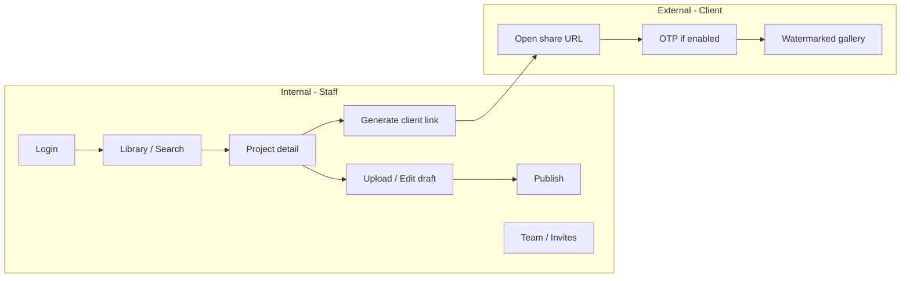
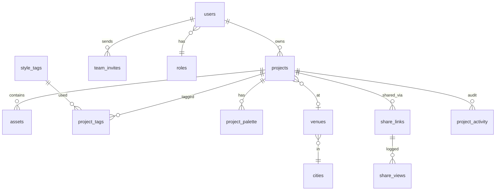
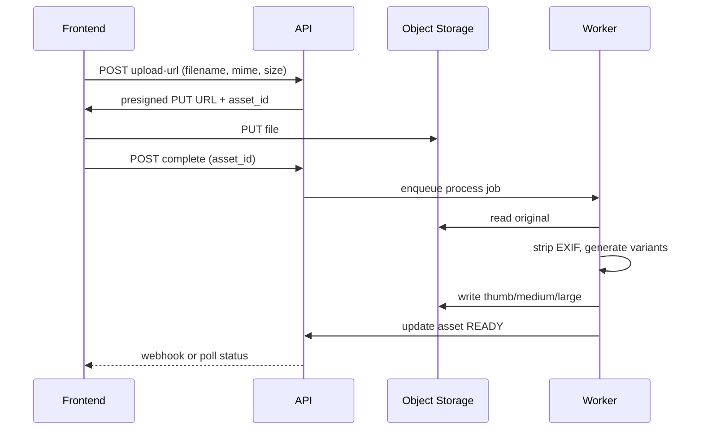

# Revaah Decor Atelier — Backend Requirements Specification

**Document version:** 1.0  
**Date:** 26 May 2026  
**Audience:** Backend engineering team  
**Status:** Superseded for day-to-day work by split docs: [`BACKEND_API_SPEC.md`](./BACKEND_API_SPEC.md) (API) and [`DATABASE_SCHEMA_SPEC.md`](./DATABASE_SCHEMA_SPEC.md) (DB).  
**Frontend reference:** `revaah project frontend` (Vite + React + TypeScript)  
**Note:** Frontend is a **UI prototype** — no live APIs yet.

---

## Table of contents

1. [Executive summary](#1-executive-summary)
2. [Product overview](#2-product-overview)
3. [Frontend screens → backend mapping](#3-frontend-screens--backend-mapping)
4. [Current vs target architecture](#4-current-vs-target-architecture)
5. [User roles & permissions (RBAC)](#5-user-roles--permissions-rbac)
6. [Functional requirements by module](#6-functional-requirements-by-module)
7. [Data model](#7-data-model)
8. [API specification (REST)](#8-api-specification-rest)
9. [Authentication & sessions](#9-authentication--sessions)
10. [Asset upload & processing pipeline](#10-asset-upload--processing-pipeline)
11. [Search](#11-search)
12. [Client share links (public)](#12-client-share-links-public)
13. [Collections, moodboards & shared links admin](#13-collections-moodboards--shared-links-admin)
14. [Notifications & integrations](#14-notifications--integrations)
15. [AI / ML services (optional phase)](#15-ai--ml-services-optional-phase)
16. [Audit, activity & analytics](#16-audit-activity--analytics)
17. [Non-functional requirements](#17-non-functional-requirements)
18. [Security requirements](#18-security-requirements)
19. [Suggested tech stack (non-binding)](#19-suggested-tech-stack-non-binding)
20. [Delivery phases](#20-delivery-phases)
21. [Open questions for product](#21-open-questions-for-product)
22. [Appendix: enums & sample payloads](#22-appendix-enums--sample-payloads)

---

## 1. Executive summary

**Revaah Decor Atelier** is an **internal portfolio platform** for a luxury wedding decor studio. Teams browse, search, and manage hundreds of past events (projects) with rich imagery, metadata, colour palettes, and style tags. Curators upload new events; owners manage the team. **Client share links** expose a subset of a project to external clients with expiry, view limits, OTP, and watermarks.

| Question | Answer |
|----------|--------|
| Is a backend required? | **Yes**, for any production use beyond a static demo |
| Frontend status | Complete UI mockup; all data hardcoded in browser |
| Recommended API style | REST (JSON) + presigned uploads for files |
| Public surface | Separate **client portal** routes (`/c/{token}`) — no staff login |

**Scale implied by UI copy (plan capacity accordingly):**

- ~412 projects, 31 cities, 87 venues, ~24k assets (hero stats on library)
- Upload batch: up to **600 files** per session, **200 MB** per file
- Formats: JPG, PNG, HEIC, MP4, MOV

---

## 2. Product overview

### 2.1 Problem statement

Decor teams need a single searchable lookbook during client calls and internal meetings. Today references are scattered (folders, WhatsApp, memory). Atelier centralises projects with consistent metadata so queries like *“Ranthambore forest wedding”* or *“peach marigold sangeet”* return results in seconds.

### 2.2 Primary users

| Persona | Access | Goals |
|---------|--------|-------|
| **Owner** | Full admin | Team, settings, all projects, revoke any share |
| **Curator** | Upload, edit, publish, share | Maintain library quality |
| **Member** | Browse; share with approval | Reference during pitches |
| **Read-only** | Browse only | View library |
| **Client (external)** | Share link only | View curated subset; no account |

### 2.3 Core workflows



---

## 3. Frontend screens → backend mapping

| UI screen | Route (proposed) | Backend dependencies |
|-----------|------------------|----------------------|
| **Login** | `/login` | Auth: email + passphrase/password, session/JWT, optional 2FA |
| **Library (Atelier home)** | `/` or `/atelier` | Projects list, filters, stats, hero aggregates |
| **Project detail** | `/projects/:id` | Project CRUD read, assets gallery, tags, palette, credits |
| **Upload event (admin)** | `/admin/projects/new`, `/admin/projects/:id/edit` | Project draft, autosave, asset upload, readiness checklist |
| **Team** | `/admin/team` | Users, roles, invites, suspend, permissions matrix |
| **Share modal** | modal on project | Share link CRUD, OTP, notifications |
| **Client view** | `/c/:token` (public) | Token validation, asset delivery, view counting, watermark config |
| **Search (top bar)** | global `⌘K` | Full-text + facet search API |
| **Moodboards** | nav placeholder | Phase 2 — board CRUD |
| **Shared Links** | nav placeholder | List/revoke all shares |
| **Collections strip** | section on library | Phase 2 — curated groupings |
| **Taxonomies / Settings** | admin sidebar | Venues, cities, tags, roles config |

**Note:** Demo bar at bottom of frontend is **dev-only** — remove in production.

---

## 4. Current vs target architecture

### 4.1 Today (frontend only)

```
Browser → Static React app
         → sessionStorage flag after hardcoded passphrase
         → Hardcoded arrays (GALLERY_CARDS, etc.)
         → Unsplash URLs as images
```

### 4.2 Target

```
┌─────────────────┐         HTTPS          ┌─────────────────────────┐
│  React SPA      │ ◄────────────────────► │  API Gateway / BFF       │
│  atelier.       │   Bearer JWT (staff)   │  - Auth, RBAC            │
│  revaahdecor.in │   Public token (/c/*)  │  - Projects, Assets      │
└─────────────────┘                        │  - Search, Shares, Team  │
         │                                 └───────────┬─────────────┘
         │                                             │
         │                                 ┌───────────▼─────────────┐
         │                                 │ PostgreSQL (metadata)    │
         │                                 │ Object storage (S3/Azure)│
         │                                 │ Redis (sessions, cache)  │
         │                                 │ Worker queue (processing)│
         │                                 │ Email/SMS (OTP, invites) │
         └────────────────────────────────►│ Optional: AI vision svc  │
              CDN for images               └─────────────────────────┘
```

---

## 5. User roles & permissions (RBAC)

Permissions **must match** the matrix shown in the Team admin UI.

| Capability | Owner | Curator | Member | Read-only |
|------------|:-----:|:-------:|:------:|:---------:|
| Browse library | ✓ | ✓ | ✓ | ✓ |
| Search & moodboards | ✓ | ✓ | ✓ | — |
| Upload & edit projects | ✓ | ✓ | — | — |
| Publish to library | ✓ | ✓ | — | — |
| Generate client share links | ✓ | ✓ | Approval* | — |
| Revoke shared links | ✓ (any) | Own only | — | — |
| Invite & manage team | ✓ | — | — | — |
| Settings & billing | ✓ | — | — | — |

\* **Member + share with approval:** backend should support `share_request` workflow (create pending share → owner/curator approves → link activated). Can be Phase 2 if MVP limits Member to no sharing.

### 5.1 Role enum

```
OWNER | CURATOR | MEMBER | READ_ONLY
```

### 5.2 Project-level visibility (upload form)

| Field | Values | Backend rule |
|-------|--------|--------------|
| Visible to | `WHOLE_TEAM`, `CURATORS_AND_OWNER`, `SPECIFIC_USERS` | Filter project in list/search |
| Shareable by | `CURATORS_AND_OWNER`, `WHOLE_TEAM`, `OWNER_ONLY` | Gate share link creation |

When `SPECIFIC_USERS`, store `project_acl` rows `(project_id, user_id)`.

---

## 6. Functional requirements by module

### 6.1 Authentication (Login screen)

**UI fields:** Email, Passphrase (prototype uses single shared passphrase — **replace in production**).

| ID | Requirement | Priority |
|----|-------------|----------|
| AUTH-01 | Staff login with **work email + password** (passphrase acceptable for v0 internal only) | P0 |
| AUTH-02 | Issue **access token** (JWT) + **refresh token**; short-lived access (~15–60 min) | P0 |
| AUTH-03 | Logout invalidates refresh token | P0 |
| AUTH-04 | Password reset via email | P1 |
| AUTH-05 | **TOTP 2FA** on first sign-in when invite flag `require_2fa` is set | P1 |
| AUTH-06 | Account lockout after N failed attempts | P1 |
| AUTH-07 | Session list / revoke (Settings — future) | P2 |

**Reject:** Storing shared passphrase in frontend bundle.

---

### 6.2 Library (home)

| ID | Requirement | Priority |
|----|-------------|----------|
| LIB-01 | Paginated project grid with cover image, city, title, event type, date, palette swatches | P0 |
| LIB-02 | Filter chips: `All`, `Wedding`, `Sangeet`, `Mehendi`, `Haldi`, `Reception`, `Engagement` (+ extensible) | P0 |
| LIB-03 | Toggle view mode: `Grid` / `Moodboard` (grid data same; layout is frontend) | P2 |
| LIB-04 | Aggregate stats: project count, city count, venue count, asset count | P1 |
| LIB-05 | **Curated collections** section (title, image, project count) | P2 |
| LIB-06 | Only return projects user is allowed to see (RBAC + project ACL) | P0 |

---

### 6.3 Project detail

| ID | Requirement | Priority |
|----|-------------|----------|
| PRJ-01 | Full project metadata (see [§7.2](#72-project)) | P0 |
| PRJ-02 | Image gallery with layout hints (`full`, `half`, `third`, etc.) — order from `sort_order` | P0 |
| PRJ-03 | Style tags list | P0 |
| PRJ-04 | Colour palette (up to 5 hex swatches) | P0 |
| PRJ-05 | Credits block (decor lead, florals, lighting, photo) — structured or text | P1 |
| PRJ-06 | Actions: generate share, add to moodboard (P2), find similar (P2 / AI) | P1/P2 |
| PRJ-07 | Slug or UUID in URL; support SEO-friendly slug optional | P1 |

**Example metadata from UI (reference project):**

- Venue: Aman-i-Khás  
- City: Ranthambore, Rajasthan  
- Event types: Wedding · Mehendi · Sangeet  
- Theme: Forest Royal — Tiger & Twilight  
- Guest count: 380 · Duration: 4 days  

---

### 6.4 Upload / edit project (admin)

| ID | Requirement | Priority |
|----|-------------|----------|
| UPL-01 | Create project in `DRAFT` status | P0 |
| UPL-02 | **Autosave** draft every N seconds (UI shows “auto-saved 4s ago”) | P1 |
| UPL-03 | Fields: title, theme, event type(s), event date, guest count, venue, city, narrative | P0 |
| UPL-04 | Venue autocomplete linked to **venue taxonomy**; auto-create new venue on commit | P1 |
| UPL-05 | Batch upload up to **600 files**, max **200 MB** each | P0 |
| UPL-06 | Accepted MIME: image/jpeg, image/png, image/heic, video/mp4, video/quicktime | P0 |
| UPL-07 | Strip **EXIF** (GPS, device) on ingest for privacy | P0 |
| UPL-08 | Generate **3 derivatives** per image (e.g. thumb, medium, large/web) | P0 |
| UPL-09 | Set one asset as **cover** | P0 |
| UPL-10 | Publish transitions `DRAFT` → `PUBLISHED`; validate readiness checklist | P0 |
| UPL-11 | Readiness API returns boolean flags for sidebar checklist | P1 |
| UPL-12 | Palette: manual swatches + optional AI extraction | P1 |
| UPL-13 | Style tags: confirmed + suggested (suggested from AI) | P1 |
| UPL-14 | Setting enum: `OUTDOOR`, `INDOOR`, `MIXED`, `DESTINATION` | P1 |
| UPL-15 | Access fields: visible_to, shareable_by, owner_of_record, photo_credit | P0 |
| UPL-16 | Activity feed on project (who did what, when) | P1 |
| UPL-17 | Preview unpublished project (staff-only token or permission) | P1 |

**Readiness checklist (backend computes):**

| Check | Rule |
|-------|------|
| Title & basics filled | title, event_type, venue, city present |
| Venue + city linked | venue_id and city_id resolved |
| Assets uploaded | count >= 1 |
| Cover image chosen | cover_asset_id set |
| Palette extracted | >= 3 swatches OR manual complete |
| Narrative | recommended, not blocking |
| AI tags confirmed | no pending suggestions OR explicitly dismissed |
| Photo credit | recommended |

---

### 6.5 Team management

| ID | Requirement | Priority |
|----|-------------|----------|
| TEAM-01 | List members: name, email, role, last_seen, project count, share count | P0 |
| TEAM-02 | Invite by email with role + department | P0 |
| TEAM-03 | Invite expires in **7 days**; resend / revoke | P0 |
| TEAM-04 | Single-use invite acceptance link → set password (+ 2FA setup) | P0 |
| TEAM-05 | Suspend / reactivate user | P1 |
| TEAM-06 | Edit role (Owner only) | P0 |
| TEAM-07 | Pending invites list | P0 |
| TEAM-08 | Team stats: active members, pending invites, curators, shares this month | P1 |
| TEAM-09 | Invite options: require_2fa, personal_welcome_note, restrict_to_projects[] | P1 |
| TEAM-10 | Export member list (CSV) | P2 |

**Departments (enum from UI):** Decor & styling, Florals, Production, Client services, Founders

---

### 6.6 Client share links

| ID | Requirement | Priority |
|----|-------------|----------|
| SHR-01 | Create share for a project with client name, email, mobile | P0 |
| SHR-02 | Expiry: 48h, 7d, 14d, 30d, custom datetime (“until meeting”) | P0 |
| SHR-03 | Max views: unlimited, 5, 10, 20 | P0 |
| SHR-04 | Options: dynamic watermark, OTP on first open, download disabled, notify on view | P0 |
| SHR-05 | Return URL: `https://atelier.revaahdecor.in/c/{opaque_token}` | P0 |
| SHR-06 | Revoke link immediately | P0 |
| SHR-07 | List shares per project + global admin list | P1 |
| SHR-08 | Curator can only revoke **own** shares; Owner any | P0 |
| SHR-09 | Record each view: timestamp, IP, user-agent (for watermark + analytics) | P1 |

---

### 6.7 Client portal (public `/c/:token`)

| ID | Requirement | Priority |
|----|-------------|----------|
| CLT-01 | Validate token: not expired, not revoked, under max views | P0 |
| CLT-02 | Return safe subset: hero, lede, selected assets with captions | P0 |
| CLT-03 | **OTP flow:** send SMS to mobile on first open; verify before gallery | P0 |
| CLT-04 | Watermark config: client name + IP + timestamp (render server-side or signed overlay URLs) | P1 |
| CLT-05 | Serve images via **signed URLs** with short TTL; no direct bucket access | P0 |
| CLT-06 | Increment view count atomically; return remaining time / views in footer | P0 |
| CLT-07 | Download disabled: no Content-Disposition attachment; optional hotlink protection | P1 |
| CLT-08 | Rate limit by IP on token endpoints | P0 |

**Note:** Frontend-only “right-click block” is not security; real protection is signed URLs + no originals + watermark.

---

### 6.8 Search

| ID | Requirement | Priority |
|----|-------------|----------|
| SRCH-01 | Global search endpoint; debounced typeahead | P0 |
| SRCH-02 | Search across: title, theme, narrative, city, venue, tags | P0 |
| SRCH-03 | Example queries from UI: “Ranthambore”, “Sabyasachi palette”, “sangeet” | P0 |
| SRCH-04 | Keyboard shortcut `⌘K` is frontend; API is `GET /search?q=` | P0 |
| SRCH-05 | Facet filters aligned with library chips | P1 |
| SRCH-06 | Future: semantic / vector search on narrative and images | P3 |

---

### 6.9 Taxonomies (admin sidebar)

| ID | Requirement | Priority |
|----|-------------|----------|
| TAX-01 | **Cities** — name, state, country | P1 |
| TAX-02 | **Venues** — name, city_id, optional geo | P1 |
| TAX-03 | **Event types** — controlled vocabulary + extensible | P0 |
| TAX-04 | **Style tags** — canonical list; merge synonyms | P1 |
| TAX-05 | Auto-add venue when curator types new name | P1 |

---

### 6.10 Moodboards & collections (Phase 2)

| ID | Requirement | Priority |
|----|-------------|----------|
| MOOD-01 | Moodboard: named set of project references or assets | P2 |
| COLL-01 | Collection: curated grouping (“Rajasthan Royal”, 28 projects) | P2 |

---

## 7. Data model

### 7.1 Entity relationship (overview)



### 7.2 `users`

| Column | Type | Notes |
|--------|------|-------|
| id | UUID | PK |
| email | VARCHAR UNIQUE | Work email |
| password_hash | VARCHAR | bcrypt/argon2 |
| full_name | VARCHAR | |
| role | ENUM | OWNER, CURATOR, MEMBER, READ_ONLY |
| department | ENUM | nullable |
| avatar_initials | VARCHAR | optional |
| status | ENUM | ACTIVE, SUSPENDED, PENDING_INVITE |
| totp_secret | VARCHAR | encrypted, nullable |
| totp_enabled | BOOLEAN | |
| last_seen_at | TIMESTAMPTZ | |
| created_at | TIMESTAMPTZ | |
| updated_at | TIMESTAMPTZ | |

### 7.3 `team_invites`

| Column | Type | Notes |
|--------|------|-------|
| id | UUID | |
| email | VARCHAR | |
| full_name | VARCHAR | |
| role | ENUM | |
| department | ENUM | |
| token_hash | VARCHAR | single-use |
| require_2fa | BOOLEAN | |
| welcome_note | TEXT | nullable |
| project_ids | UUID[] | restrict access |
| expires_at | TIMESTAMPTZ | default +7 days |
| accepted_at | TIMESTAMPTZ | nullable |
| invited_by | UUID FK users | |

### 7.4 `projects`

| Column | Type | Notes |
|--------|------|-------|
| id | UUID | PK |
| slug | VARCHAR UNIQUE | optional |
| title | VARCHAR | e.g. "Of Tigers & Twilight" |
| theme | VARCHAR | e.g. "Forest Royal" |
| narrative | TEXT | searchable |
| status | ENUM | DRAFT, PUBLISHED, ARCHIVED |
| event_types | VARCHAR[] or junction | Wedding, Sangeet, etc. |
| event_date | DATE | |
| guest_count | INT | nullable |
| setting | ENUM | OUTDOOR, INDOOR, MIXED, DESTINATION |
| venue_id | UUID FK | |
| city_id | UUID FK | denormalise for query |
| cover_asset_id | UUID FK assets | |
| visible_to | ENUM | WHOLE_TEAM, CURATORS_AND_OWNER, SPECIFIC_USERS |
| shareable_by | ENUM | CURATORS_AND_OWNER, WHOLE_TEAM, OWNER_ONLY |
| owner_of_record_id | UUID FK users | |
| photo_credit | VARCHAR | |
| duration_days | INT | optional |
| published_at | TIMESTAMPTZ | |
| created_by | UUID FK | |
| updated_at | TIMESTAMPTZ | autosave |

### 7.5 `assets`

| Column | Type | Notes |
|--------|------|-------|
| id | UUID | |
| project_id | UUID FK | |
| kind | ENUM | IMAGE, VIDEO |
| original_filename | VARCHAR | |
| mime_type | VARCHAR | |
| byte_size | BIGINT | |
| width | INT | |
| height | INT | |
| duration_sec | FLOAT | videos |
| storage_key_original | VARCHAR | private bucket |
| storage_key_thumb | VARCHAR | |
| storage_key_medium | VARCHAR | |
| storage_key_large | VARCHAR | |
| exif_stripped | BOOLEAN | |
| is_cover | BOOLEAN | |
| sort_order | INT | gallery layout |
| caption | VARCHAR | client tile |
| caption_sub | VARCHAR | e.g. "Mehendi · Forest Grove" |
| processing_status | ENUM | PENDING, PROCESSING, READY, FAILED |
| ai_tags_status | ENUM | optional |
| uploaded_by | UUID FK | |
| created_at | TIMESTAMPTZ | |

### 7.6 `project_palette`

| Column | Type | Notes |
|--------|------|-------|
| project_id | UUID | |
| position | INT | 0–4 |
| hex | CHAR(7) | #RRGGBB |
| source | ENUM | MANUAL, AI |

### 7.7 `style_tags` / `project_tags`

- `style_tags(id, name, slug)`  
- `project_tags(project_id, tag_id, source: MANUAL | AI_SUGGESTED | AI_ACCEPTED)`

### 7.8 `share_links`

| Column | Type | Notes |
|--------|------|-------|
| id | UUID | |
| project_id | UUID FK | |
| token_hash | VARCHAR | lookup by hash of opaque token |
| client_name | VARCHAR | |
| client_email | VARCHAR | |
| client_mobile | VARCHAR | E.164 |
| expires_at | TIMESTAMPTZ | |
| max_views | INT | NULL = unlimited |
| view_count | INT | |
| watermark_enabled | BOOLEAN | |
| otp_required | BOOLEAN | |
| download_disabled | BOOLEAN | |
| notify_on_view | BOOLEAN | |
| created_by | UUID FK | |
| revoked_at | TIMESTAMPTZ | nullable |
| created_at | TIMESTAMPTZ | |

### 7.9 `share_views`

| Column | Type | Notes |
|--------|------|-------|
| id | UUID | |
| share_link_id | UUID | |
| viewed_at | TIMESTAMPTZ | |
| ip_address | INET | |
| user_agent | TEXT | |

### 7.10 `project_activity`

| id | project_id | actor_id | action | metadata JSON | created_at |

Examples: `CREATED`, `ASSET_UPLOADED`, `PUBLISHED`, `TAG_SUGGESTED`, `SHARE_CREATED`

### 7.11 `cities` / `venues`

- `cities(id, name, region, country)`  
- `venues(id, name, city_id, normalised_name for search)`

---

## 8. API specification (REST)

**Base URL:** `https://api.atelier.revaahdecor.in/v1` (proposed)  
**Format:** JSON `application/json`  
**Staff auth:** `Authorization: Bearer <access_token>`  
**Errors:** RFC 7807 Problem Details or consistent `{ "error": { "code", "message", "details" } }`

### 8.1 Auth

| Method | Path | Description |
|--------|------|-------------|
| POST | `/auth/login` | `{ email, password }` → tokens + user |
| POST | `/auth/refresh` | `{ refresh_token }` |
| POST | `/auth/logout` | invalidate refresh |
| POST | `/auth/forgot-password` | email link |
| POST | `/auth/reset-password` | token + new password |
| POST | `/auth/2fa/verify` | TOTP code after login |
| POST | `/auth/invite/accept` | invite token + password + optional TOTP setup |

### 8.2 Projects

| Method | Path | Description |
|--------|------|-------------|
| GET | `/projects` | List + filters (`event_type`, `status`, page, limit) |
| GET | `/projects/stats` | Aggregate counts for library hero |
| POST | `/projects` | Create draft |
| GET | `/projects/:id` | Detail + gallery + tags + palette |
| PATCH | `/projects/:id` | Update (autosave) |
| POST | `/projects/:id/publish` | Validate readiness → publish |
| DELETE | `/projects/:id` | Soft delete / archive |
| GET | `/projects/:id/readiness` | Checklist flags |
| GET | `/projects/:id/activity` | Activity feed |

### 8.3 Assets

| Method | Path | Description |
|--------|------|-------------|
| POST | `/projects/:id/assets/upload-url` | Presigned URL(s) for direct upload |
| POST | `/projects/:id/assets/complete` | Confirm upload, enqueue processing |
| GET | `/projects/:id/assets` | List assets |
| PATCH | `/assets/:id` | caption, sort_order, is_cover |
| DELETE | `/assets/:id` | Remove |

### 8.4 Search

| Method | Path | Description |
|--------|------|-------------|
| GET | `/search?q=&event_type=&city=` | Unified search |

### 8.5 Share links (staff)

| Method | Path | Description |
|--------|------|-------------|
| POST | `/projects/:id/shares` | Create link |
| GET | `/projects/:id/shares` | List |
| GET | `/shares` | Global list (admin) |
| POST | `/shares/:id/revoke` | Revoke |

### 8.6 Client portal (public — no JWT)

| Method | Path | Description |
|--------|------|-------------|
| GET | `/public/shares/:token` | Metadata + expiry (pre-OTP) |
| POST | `/public/shares/:token/otp/send` | Send SMS OTP |
| POST | `/public/shares/:token/otp/verify` | `{ code }` → session cookie or short-lived view JWT |
| GET | `/public/shares/:token/gallery` | Assets with signed URLs (requires OTP if enabled) |

### 8.7 Team

| Method | Path | Description |
|--------|------|-------------|
| GET | `/team/members` | |
| POST | `/team/invites` | |
| GET | `/team/invites` | pending |
| POST | `/team/invites/:id/resend` | |
| POST | `/team/invites/:id/revoke` | |
| PATCH | `/team/members/:id` | role, suspend |
| GET | `/team/stats` | |

### 8.8 Taxonomies

| Method | Path | Description |
|--------|------|-------------|
| GET | `/taxonomies/venues?q=` | autocomplete |
| GET | `/taxonomies/cities` | |
| GET | `/taxonomies/tags` | |
| POST | `/taxonomies/venues` | create if not exists |

---

## 9. Authentication & sessions

- **Password hashing:** Argon2id or bcrypt (cost factor documented).
- **JWT claims:** `sub` (user_id), `role`, `exp`, `iss`.
- **Refresh tokens:** stored hashed in DB or Redis with rotation on use.
- **RBAC middleware:** check role + project-level ACL on every project route.
- **Public routes:** only `/public/shares/*` and health — rate limited.
- **CORS:** allow `https://atelier.revaahdecor.in` (staff SPA).
- **Invite flow:** cryptographically random token, store hash only.

---

## 10. Asset upload & processing pipeline



| Step | Detail |
|------|--------|
| Validation | Reject >200MB or wrong MIME before presign |
| EXIF | Strip location/camera; keep orientation |
| Derivatives | Example: 400px, 1200px, 2400px long edge |
| Video | Poster frame + compressed stream (HLS optional P2) |
| Failure | `FAILED` status + retry; surface in UI |
| Cover | Setting `is_cover` clears other covers on same project |

---

## 11. Search

**MVP:** PostgreSQL `tsvector` on title, theme, narrative, venue name, city, tag names.

**Indexes:**

- GIN on search document  
- B-tree on `event_type`, `city_id`, `status`, `published_at`

**Response shape:**

```json
{
  "results": [
    {
      "id": "uuid",
      "title": "Of Tigers & Twilight",
      "city": "Ranthambore",
      "venue": "Aman-i-Khás",
      "cover_url": "https://...",
      "palette": ["#5C1A2B", "#B8893A"],
      "highlight": "...forest <em>royal</em>..."
    }
  ],
  "total": 12,
  "page": 1
}
```

---

## 12. Client share links (public)

### 12.1 Token design

- Opaque token: ≥128 bits random, URL-safe (e.g. `9X2-fK8L-aR4n` style but longer internally).
- Store **SHA-256 hash** in DB only.

### 12.2 OTP

- 6-digit code, 10-minute validity, max 3 attempts.
- SMS provider (Twilio / MSG91 / AWS SNS) — **India +91** numbers primary.
- After verify, issue **view session** cookie (httpOnly, secure, same-site) bound to share_link_id.

### 12.3 Watermark

- Dynamic text: `{client_name} · revaah · {date} · view only` + optional IP.
- Prefer **server-rendered** overlay on medium derivative or CDN image processing.
- Frontend overlay alone is **not** sufficient for leakage prevention.

### 12.4 View counting

- Increment on successful gallery load (after OTP).
- Return `views_remaining`, `expires_in_seconds` for footer timer.

---

## 13. Collections, moodboards & shared links admin

**Shared Links nav:** `GET /shares` with filters (active, expired, by project, by creator).

**Collections:** many-to-many `collection_projects(collection_id, project_id, sort_order)`.

**Moodboards:** `moodboards` + `moodboard_items` (project_id or asset_id, note).

---

## 14. Notifications & integrations

| Event | Channel | Priority |
|-------|---------|----------|
| Team invite | Email | P0 |
| Password reset | Email | P0 |
| Share OTP | SMS | P0 |
| Share viewed (if notify_on_view) | Email + Slack webhook | P1 |
| Asset processing complete | Optional websocket/poll | P2 |

**Slack:** incoming webhook URL in env; post JSON on share view.

---

## 15. AI / ML services (optional phase)

UI promises (treat as **async jobs**, not blocking API):

| Feature | Input | Output |
|---------|-------|--------|
| Auto tags | Image bytes / URLs | Suggested style_tags |
| Palette extraction | Cover + sample frames | 3–5 hex swatches (`source: AI`) |
| Find similar | project_id | Ranked project IDs (embeddings) |

**Contract:**

- `POST /projects/:id/ai/analyze` → `job_id`  
- `GET /jobs/:id` → status + results  
- Curator **accepts** suggestions → moves to `AI_ACCEPTED` on project_tags

---

## 16. Audit, activity & analytics

- Immutable **audit log** for: login, publish, share create/revoke, invite, role change.
- **project_activity** feed for upload UI sidebar.
- Optional: aggregate “shares this month” for team dashboard.

---

## 17. Non-functional requirements

| Area | Requirement |
|------|-------------|
| Availability | 99.5% MVP (business hours internal tool) |
| Latency | API p95 < 300ms (excl. upload); search < 500ms |
| Storage | Plan for 5–50 TB media growth |
| Concurrency | 20+ simultaneous staff users; 100+ client views/day |
| Backups | DB daily; object storage versioning |
| Environments | dev, staging, production |
| Localisation | English first; dates IST |
| API versioning | `/v1` prefix |

---

## 18. Security requirements

| ID | Requirement |
|----|-------------|
| SEC-01 | TLS everywhere |
| SEC-02 | No secrets in frontend (remove demo passphrase) |
| SEC-03 | Presigned URLs expire ≤ 15 minutes |
| SEC-04 | Rate limit auth and OTP endpoints |
| SEC-05 | Input validation on all write endpoints |
| SEC-06 | Content-Type verification on upload (magic bytes) |
| SEC-07 | Virus scan on upload (ClamAV or cloud AV) — P1 |
| SEC-08 | GDPR-style: ability to delete client PII from shares |
| SEC-09 | Log access to client galleries for compliance |

---

## 19. Suggested tech stack (non-binding)

| Layer | Options |
|-------|---------|
| API | Node (NestJS), Python (FastAPI), Java (Spring) — team preference |
| DB | PostgreSQL 15+ |
| Cache | Redis |
| Object storage | AWS S3 or Azure Blob (TBS already uses Azure — may reuse patterns) |
| Queue | SQS, BullMQ, or Azure Service Bus |
| Search | Postgres FTS → OpenSearch if needed later |
| SMS | MSG91 / Twilio |

---

## 20. Delivery phases

### Phase 0 — Foundation (2–3 weeks)

- Project setup, DB schema, CI/CD  
- Auth (login, JWT, roles)  
- Projects CRUD (draft only, no files)  
- Frontend integration for login + library list (empty)

### Phase 1 — MVP internal (4–6 weeks)

- Asset upload + processing + gallery  
- Publish + library filters  
- Basic search  
- Team invites + RBAC  
- Project detail

### Phase 2 — Client sharing (3–4 weeks)

- Share links + OTP + public gallery  
- Signed URLs + view limits  
- Share admin list + revoke  
- Notifications (email/SMS)

### Phase 3 — Enhancements (ongoing)

- AI tags / palette jobs  
- Collections & moodboards  
- Member share approval workflow  
- Semantic search  
- Settings & billing

---

## 21. Open questions for product

| # | Question | Impact |
|---|----------|--------|
| 1 | Single tenant (Revaah only) or multi-tenant SaaS? | Schema isolation |
| 2 | Replace passphrase with SSO (Google Workspace)? | Auth design |
| 3 | Video: stream in client view or images only for v1? | Processing cost |
| 4 | Which SMS/email provider accounts exist? | Integration |
| 5 | Data residency — India only? | Region selection |
| 6 | Existing DAM or migrate historical 24k assets? | Migration project |
| 7 | Moodboards in MVP or Phase 2? | Scope |
| 8 | Legal watermark requirements for client shares? | Image pipeline |

---

## 22. Appendix: enums & sample payloads

### 22.1 Event types (initial seed)

`WEDDING`, `SANGEET`, `MEHENDI`, `HALDI`, `RECEPTION`, `ENGAGEMENT`, `ANNIVERSARY`, `PRE_WEDDING`

### 22.2 POST `/projects` (create draft)

```json
{
  "title": "Of Tigers & Twilight",
  "theme": "Forest Royal",
  "event_types": ["WEDDING", "MEHENDI", "SANGEET"],
  "event_date": "2025-12-15",
  "guest_count": 380,
  "venue_name": "Aman-i-Khás",
  "city_name": "Ranthambore",
  "narrative": "A four-day affair built within the tented camp…",
  "setting": "OUTDOOR",
  "visible_to": "WHOLE_TEAM",
  "shareable_by": "CURATORS_AND_OWNER",
  "photo_credit": "The Rabbit Hole Co."
}
```

### 22.3 POST `/projects/:id/shares`

```json
{
  "client_name": "Ananya Mehta",
  "client_email": "ananya@mehtagroup.in",
  "client_mobile": "+9198XXXXXXXX",
  "expires_after": "7_DAYS",
  "max_views": 20,
  "watermark_enabled": true,
  "otp_required": true,
  "download_disabled": true,
  "notify_on_view": false
}
```

**Response:**

```json
{
  "id": "uuid",
  "url": "https://atelier.revaahdecor.in/c/9X2-fK8L-aR4n",
  "expires_at": "2026-05-28T21:00:00+05:30",
  "otp_required": true
}
```

### 22.4 GET `/projects` (list item)

```json
{
  "id": "uuid",
  "title": "Of Tigers & Twilight",
  "city": "Ranthambore",
  "venue": "Aman-i-Khás",
  "event_types": ["WEDDING"],
  "event_date": "2025-12-15",
  "cover_url": "https://cdn.../thumb/abc.jpg",
  "palette": ["#5C1A2B", "#B8893A", "#3E4A2B", "#E8C8B8", "#2A2017"],
  "status": "PUBLISHED"
}
```

---

## Document control

| Version | Date | Author | Changes |
|---------|------|--------|---------|
| 1.0 | 2026-05-26 | Frontend / Product | Initial spec from UI prototype |

**Frontend repo path for UI reference:**  
`/Users/shivani/revaah project frontend`  
Key files: `src/components/views/*`, `legacy/index.html` (full original mockup)

**Contact for UI questions:** Frontend team  
**Contact for scope:** Product owner (Revaah Decor)

---

*End of backend requirements specification.*
