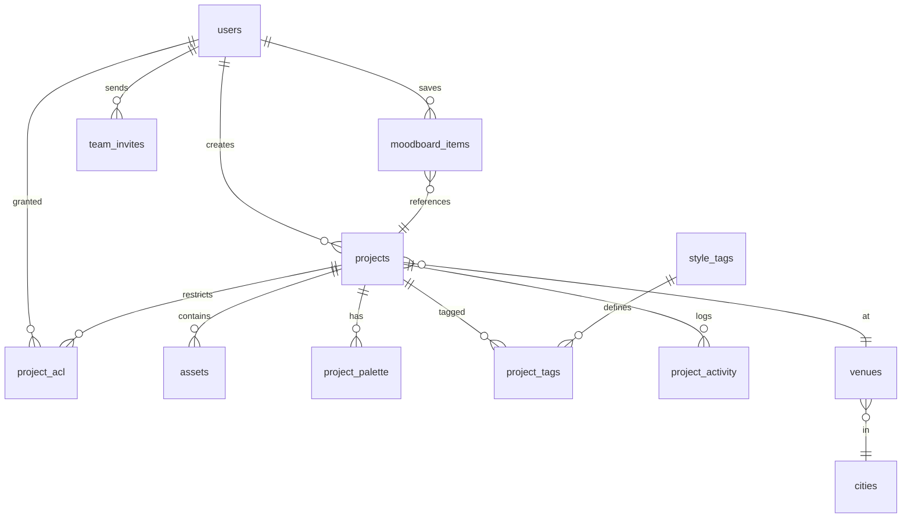

# Revaah Decor Atelier — Database Schema Specification

**Version:** 1.0  
**Date:** 26 May 2026  
**Audience:** Database engineering team  
**Related doc (API only):** [`BACKEND_API_SPEC.md`](./BACKEND_API_SPEC.md)  
**Frontend repo:** `revaah project frontend` (for field/UI reference only)

---

## How to use this document

| You are | Read |
|---------|------|
| **Database team** | This entire document |
| **API / backend team** | §1 summary + §3 tables (alignment); implement HTTP per `BACKEND_API_SPEC.md` |
| **Frontend team** | Do not use — consume REST JSON only |

**Your deliverables:** ER diagram, migrations, indexes, constraints, seed data, handoff to API team.

---

## Table of contents

1. [Overview](#1-overview)  
2. [Deliverables checklist](#2-deliverables-checklist)  
3. [Entity relationship diagram](#3-entity-relationship-diagram)  
4. [Enum types](#4-enum-types)  
5. [Tables (Phase 1 — MVP)](#5-tables-phase-1--mvp)  
6. [Indexes & query patterns](#6-indexes--query-patterns)  
7. [Constraints & cascades](#7-constraints--cascades)  
8. [Seed data](#8-seed-data)  
9. [Full-text search (MVP)](#9-full-text-search-mvp)  
10. [Phase 2 / deferred tables](#10-phase-2--deferred-tables)  
11. [Alignment with API team](#11-alignment-with-api-team)  
12. [Open questions](#12-open-questions)

---

## 1. Overview

| Item | Decision |
|------|----------|
| Recommended engine | **PostgreSQL 15+** (or org standard equivalent) |
| Primary keys | UUID (`gen_random_uuid()` or app-generated) |
| Timestamps | `TIMESTAMPTZ`, store **UTC** |
| Soft delete | `projects.status = ARCHIVED` (no hard delete in MVP) |
| Media files | **Not in DB** — only `storage_key_*` pointers; files live in object storage (S3/Azure) |
| Migrations | Owned by **database team** — Flyway, Liquibase, Alembic, or raw SQL |

**Scale to plan for:** ~412 projects, ~24k assets, list/filter/search under 500ms with proper indexes.

---

## 2. Deliverables checklist

| # | Deliverable | Done |
|---|-------------|:----:|
| 1 | ER diagram matching §3 | ☐ |
| 2 | Migration scripts (versioned) | ☐ |
| 3 | All §5 tables + §4 enums | ☐ |
| 4 | Indexes from §6 | ☐ |
| 5 | Seed data from §8 | ☐ |
| 6 | Review session with API team (§11) | ☐ |
| 7 | Staging DB connection info for API team | ☐ |

---

## 3. Entity relationship diagram



**Phase 2 (deferred):** `share_links`, `share_views`, `collections`, `collection_projects`

---

## 4. Enum types

Use Postgres `ENUM` types or lookup tables — **pick one approach** and document for API team.

```
user_role:              OWNER | CURATOR | MEMBER | READ_ONLY
user_status:            ACTIVE | SUSPENDED | PENDING
project_status:         DRAFT | PUBLISHED | ARCHIVED
project_setting:        OUTDOOR | INDOOR | MIXED | DESTINATION
visible_to:             WHOLE_TEAM | CURATORS_AND_OWNER | SPECIFIC_USERS
shareable_by:           CURATORS_AND_OWNER | WHOLE_TEAM | OWNER_ONLY
asset_kind:             IMAGE | VIDEO
asset_processing_status: PENDING | PROCESSING | READY | FAILED
palette_source:         MANUAL | AI
tag_source:             MANUAL | AI_SUGGESTED | AI_ACCEPTED
activity_action:        CREATED | UPDATED | ASSET_UPLOADED | COVER_SET | PUBLISHED | UNPUBLISHED | ARCHIVED
```

---

## 5. Tables (Phase 1 — MVP)

### 5.1 `users`

| Column | Type | Constraints | Notes |
|--------|------|-------------|-------|
| id | UUID | PK | |
| email | VARCHAR(255) | UNIQUE, NOT NULL | Work email |
| password_hash | VARCHAR(255) | NOT NULL | bcrypt/argon2 |
| full_name | VARCHAR(255) | NOT NULL | |
| role | user_role | NOT NULL | |
| department | VARCHAR(100) | NULL | Decor, Florals, etc. |
| status | user_status | NOT NULL, DEFAULT ACTIVE | |
| totp_secret | VARCHAR(255) | NULL | Encrypted at app layer |
| totp_enabled | BOOLEAN | NOT NULL, DEFAULT false | |
| last_seen_at | TIMESTAMPTZ | NULL | Updated by API on requests |
| created_at | TIMESTAMPTZ | NOT NULL, DEFAULT now() | |
| updated_at | TIMESTAMPTZ | NOT NULL, DEFAULT now() | |

### 5.2 `team_invites`

| Column | Type | Constraints | Notes |
|--------|------|-------------|-------|
| id | UUID | PK | |
| email | VARCHAR(255) | NOT NULL | |
| full_name | VARCHAR(255) | NOT NULL | |
| role | user_role | NOT NULL | |
| department | VARCHAR(100) | NULL | |
| token_hash | VARCHAR(64) | UNIQUE, NOT NULL | SHA-256 of invite token |
| require_2fa | BOOLEAN | NOT NULL, DEFAULT false | |
| welcome_note | TEXT | NULL | |
| project_ids | UUID[] | NULL | Restrict to projects if set |
| expires_at | TIMESTAMPTZ | NOT NULL | Default now() + 7 days |
| accepted_at | TIMESTAMPTZ | NULL | |
| invited_by | UUID | FK → users(id) | |
| created_at | TIMESTAMPTZ | NOT NULL, DEFAULT now() | |

### 5.3 `cities`

| Column | Type | Constraints | Notes |
|--------|------|-------------|-------|
| id | UUID | PK | |
| name | VARCHAR(255) | NOT NULL | e.g. Ranthambore |
| region | VARCHAR(255) | NULL | State/province |
| country | VARCHAR(100) | NOT NULL, DEFAULT 'IN' | |
| slug | VARCHAR(255) | UNIQUE | URL-safe |
| created_at | TIMESTAMPTZ | NOT NULL, DEFAULT now() | |

### 5.4 `venues`

| Column | Type | Constraints | Notes |
|--------|------|-------------|-------|
| id | UUID | PK | |
| name | VARCHAR(255) | NOT NULL | e.g. Aman-i-Khás |
| city_id | UUID | FK → cities(id), NOT NULL | |
| normalised_name | VARCHAR(255) | NOT NULL | Lowercase, no punctuation — autocomplete |
| created_at | TIMESTAMPTZ | NOT NULL, DEFAULT now() | |

**Index:** `venues(normalised_name)` or `GIN` trigram for `LIKE` search.

### 5.5 `projects`

| Column | Type | Constraints | Notes |
|--------|------|-------------|-------|
| id | UUID | PK | |
| slug | VARCHAR(255) | UNIQUE, NULL | Optional public slug |
| title | VARCHAR(500) | NOT NULL | |
| theme | VARCHAR(255) | NULL | |
| narrative | TEXT | NULL | Full-text indexed |
| status | project_status | NOT NULL, DEFAULT DRAFT | |
| event_types | TEXT[] | NOT NULL, DEFAULT '{}' | WEDDING, SANGEET, … |
| event_date | DATE | NULL | |
| guest_count | INTEGER | NULL | |
| duration_days | INTEGER | NULL | |
| setting | project_setting | NULL | |
| venue_id | UUID | FK → venues(id), NULL | Required before publish (app rule) |
| city_id | UUID | FK → cities(id), NULL | Denormalised for filters |
| cover_asset_id | UUID | FK → assets(id), NULL | Set when cover chosen |
| visible_to | visible_to | NOT NULL, DEFAULT WHOLE_TEAM | |
| shareable_by | shareable_by | NOT NULL, DEFAULT CURATORS_AND_OWNER | |
| owner_of_record_id | UUID | FK → users(id), NULL | |
| photo_credit | VARCHAR(255) | NULL | |
| credits | JSONB | NULL | decor_lead, florals, lighting, photography |
| published_at | TIMESTAMPTZ | NULL | Set on publish |
| created_by | UUID | FK → users(id), NOT NULL | |
| created_at | TIMESTAMPTZ | NOT NULL, DEFAULT now() | |
| updated_at | TIMESTAMPTZ | NOT NULL, DEFAULT now() | |

**Note:** `cover_asset_id` FK to `assets` may require deferred constraint or two-step migration (assets created after project).

### 5.6 `project_acl`

When `projects.visible_to = SPECIFIC_USERS`, rows here define access.

| Column | Type | Constraints |
|--------|------|-------------|
| project_id | UUID | FK → projects(id) ON DELETE CASCADE |
| user_id | UUID | FK → users(id) ON DELETE CASCADE |
| created_at | TIMESTAMPTZ | NOT NULL, DEFAULT now() |

**PK:** `(project_id, user_id)`

### 5.7 `assets`

| Column | Type | Constraints | Notes |
|--------|------|-------------|-------|
| id | UUID | PK | |
| project_id | UUID | FK → projects(id) ON DELETE CASCADE | |
| kind | asset_kind | NOT NULL | |
| original_filename | VARCHAR(500) | NOT NULL | |
| mime_type | VARCHAR(100) | NOT NULL | |
| byte_size | BIGINT | NOT NULL | Max 209715200 (200 MB) check optional |
| width | INTEGER | NULL | |
| height | INTEGER | NULL | |
| duration_sec | DOUBLE PRECISION | NULL | Videos |
| storage_key_original | VARCHAR(1024) | NOT NULL | Private bucket path |
| storage_key_thumb | VARCHAR(1024) | NULL | |
| storage_key_medium | VARCHAR(1024) | NULL | |
| storage_key_large | VARCHAR(1024) | NULL | |
| exif_stripped | BOOLEAN | NOT NULL, DEFAULT false | |
| processing_status | asset_processing_status | NOT NULL, DEFAULT PENDING | |
| is_cover | BOOLEAN | NOT NULL, DEFAULT false | Only one true per project (app + partial unique index) |
| sort_order | INTEGER | NOT NULL, DEFAULT 0 | Gallery order |
| caption | VARCHAR(500) | NULL | Client tile title |
| caption_sub | VARCHAR(255) | NULL | e.g. Mehendi · Forest Grove |
| uploaded_by | UUID | FK → users(id) | |
| created_at | TIMESTAMPTZ | NOT NULL, DEFAULT now() | |

**Partial unique index (recommended):** one cover per project  
`CREATE UNIQUE INDEX assets_one_cover_per_project ON assets (project_id) WHERE is_cover = true;`

### 5.8 `project_palette`

| Column | Type | Constraints |
|--------|------|-------------|
| project_id | UUID | FK → projects(id) ON DELETE CASCADE |
| position | SMALLINT | NOT NULL, CHECK (position BETWEEN 0 AND 4) |
| hex | CHAR(7) | NOT NULL, CHECK (hex ~ '^#[0-9A-Fa-f]{6}$') |
| source | palette_source | NOT NULL, DEFAULT MANUAL |

**PK:** `(project_id, position)`

### 5.9 `style_tags`

| Column | Type | Constraints |
|--------|------|-------------|
| id | UUID | PK |
| name | VARCHAR(255) | NOT NULL |
| slug | VARCHAR(255) | UNIQUE, NOT NULL |

### 5.10 `project_tags`

| Column | Type | Constraints |
|--------|------|-------------|
| project_id | UUID | FK → projects(id) ON DELETE CASCADE |
| tag_id | UUID | FK → style_tags(id) |
| source | tag_source | NOT NULL, DEFAULT MANUAL |

**PK:** `(project_id, tag_id)`

### 5.11 `moodboard_items`

| Column | Type | Constraints |
|--------|------|-------------|
| id | UUID | PK |
| user_id | UUID | FK → users(id) ON DELETE CASCADE |
| project_id | UUID | FK → projects(id) ON DELETE CASCADE |
| created_at | TIMESTAMPTZ | NOT NULL, DEFAULT now() |

**UNIQUE:** `(user_id, project_id)`

### 5.12 `project_activity`

| Column | Type | Constraints |
|--------|------|-------------|
| id | UUID | PK |
| project_id | UUID | FK → projects(id) ON DELETE CASCADE |
| actor_id | UUID | FK → users(id) |
| action | activity_action | NOT NULL |
| metadata | JSONB | NULL |
| created_at | TIMESTAMPTZ | NOT NULL, DEFAULT now() |

**Index:** `(project_id, created_at DESC)` for activity feed.

---

## 6. Indexes & query patterns

Indexes required to support API list/filter/search (see `BACKEND_API_SPEC.md`).

| Query pattern | Suggested index |
|---------------|-----------------|
| Published projects, newest first | `(status, published_at DESC)` WHERE status = PUBLISHED |
| Filter by event type | `GIN (event_types)` on projects |
| Filter by city | `(city_id)` WHERE status = PUBLISHED |
| Project assets by order | `(project_id, sort_order)` on assets |
| Moodboard by user | `(user_id, created_at DESC)` on moodboard_items |
| Venue autocomplete | `GIN (normalised_name gin_trgm_ops)` or btree prefix |
| User email login | Unique on `users(email)` already |

---

## 7. Constraints & cascades

| Rule | Implementation |
|------|----------------|
| Delete project | CASCADE to assets, palette, tags, activity, moodboard_items, project_acl |
| Delete user | RESTRICT if they own projects; or reassign `created_by` — **agree with API team** |
| Archive project | API sets `status = ARCHIVED`; optional job deletes `moodboard_items` for that project |
| Cover asset | Must belong to same `project_id` as `projects.cover_asset_id` — enforce in API or trigger |

---

## 8. Seed data

### 8.1 Event types (stored in `projects.event_types` array values)

```
WEDDING, SANGEET, MEHENDI, HALDI, RECEPTION, ENGAGEMENT, ANNIVERSARY, PRE_WEDDING
```

### 8.2 Sample cities & venues

| City | Venue |
|------|-------|
| Ranthambore | Aman-i-Khás |
| Jaipur | Rambagh Palace |
| Udaipur | Taj Lake Palace |

### 8.3 Test users (staging only — change passwords)

| Email | Role | Password |
|-------|------|----------|
| owner@revaahdecor.in | OWNER | (set in seed script) |
| curator@revaahdecor.in | CURATOR | |
| member@revaahdecor.in | MEMBER | |
| readonly@revaahdecor.in | READ_ONLY | |

---

## 9. Full-text search (MVP)

API team will call search endpoints; DB team provides:

**Option A — Generated column on `projects`:**

```sql
-- Example only; adjust weights with API team
ALTER TABLE projects ADD COLUMN search_vector tsvector
  GENERATED ALWAYS AS (
    setweight(to_tsvector('english', coalesce(title,'')), 'A') ||
    setweight(to_tsvector('english', coalesce(theme,'')), 'B') ||
    setweight(to_tsvector('english', coalesce(narrative,'')), 'C')
  ) STORED;
CREATE INDEX projects_search_idx ON projects USING GIN (search_vector);
```

Join to `venues.name`, `cities.name`, `style_tags.name` in API layer or materialized view — **workshop with API team**.

---

## 10. Phase 2 / deferred tables

Do **not** implement until product approves (documented for future migrations).

### 10.1 `share_links` (client sharing — deferred)

| Column | Type | Notes |
|--------|------|-------|
| id | UUID | PK |
| project_id | UUID | FK |
| token_hash | VARCHAR(64) | UNIQUE |
| client_name | VARCHAR | |
| client_email | VARCHAR | |
| client_mobile | VARCHAR | |
| expires_at | TIMESTAMPTZ | |
| max_views | INT | NULL = unlimited |
| view_count | INT | DEFAULT 0 |
| watermark_enabled | BOOLEAN | |
| otp_required | BOOLEAN | |
| download_disabled | BOOLEAN | |
| notify_on_view | BOOLEAN | |
| created_by | UUID | FK users |
| revoked_at | TIMESTAMPTZ | NULL |
| created_at | TIMESTAMPTZ | |

### 10.2 `share_views` (deferred)

| Column | Type |
|--------|------|
| id | UUID PK |
| share_link_id | UUID FK |
| viewed_at | TIMESTAMPTZ |
| ip_address | INET |
| user_agent | TEXT |

### 10.3 `collections` / `collection_projects` (deferred)

For “Curated worlds” strip on Atelier home.

---

## 11. Alignment with API team

Before marking migrations final, confirm with API team:

| Topic | DB team | API team |
|-------|-----------|----------|
| Table/column names match JSON fields | ✓ | ✓ |
| Enum string values match API responses | ✓ | ✓ |
| `event_types` TEXT[] vs junction table | Propose | Confirm filter query |
| `cover_asset_id` circular FK | Propose deferrable FK | Confirm upload order |
| Connection pooling | Provide URL | Configure ORM |
| Migration run order | Own | Consumes after apply |

**API contract:** [`BACKEND_API_SPEC.md`](./BACKEND_API_SPEC.md)

---

## 12. Open questions

| # | Question | Owner |
|---|----------|-------|
| 1 | Postgres vs MySQL org standard? | Infra |
| 2 | `event_types` array vs `project_event_types` junction? | DB + API |
| 3 | Read replica for reporting? | Infra |
| 4 | Retention policy for `project_activity` rows? | Product |

---

## Document history

| Version | Date | Changes |
|---------|------|---------|
| 1.0 | 2026-05-26 | Split from backend spec; full schema for database team |

---

*End of Database Schema Specification*
