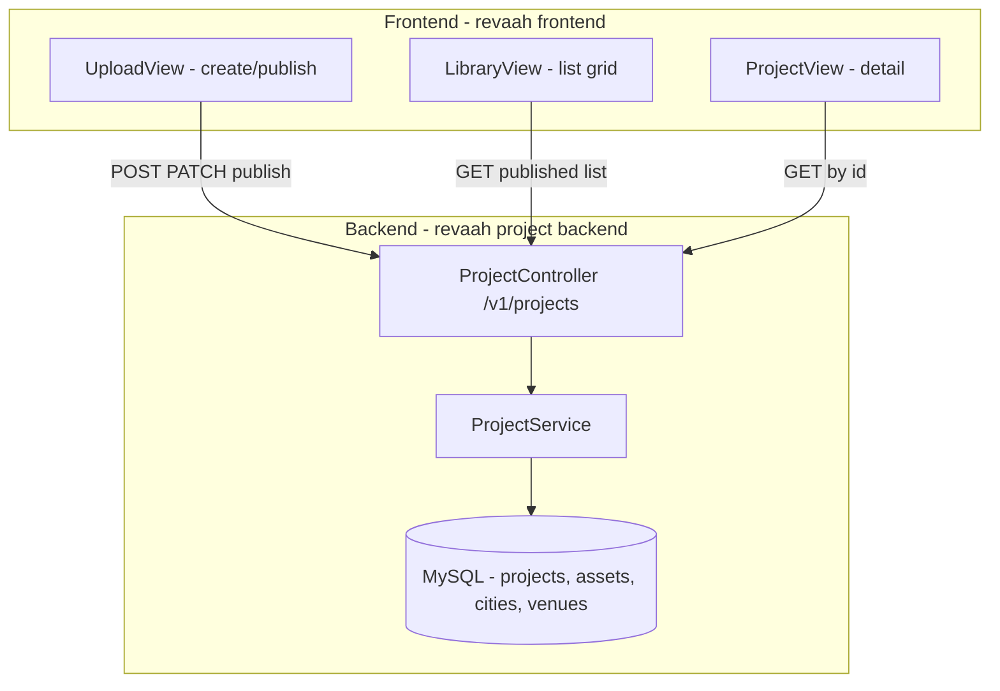

# Revaah Backend — Complete Implementation Guide

**For:** Backend API team, database team  
**Date:** 26 May 2026  
**Frontend repo:** `revaah frontend` (Revaah Decor Atelier)  
**Backend repo:** `revaah project backend` (Spring Boot — already started)  
**Reference (TBS):** [tbs-backend](https://github.com/shubham-brideside/tbs-backend.git) + [tbs-frontend](https://github.com/shubham-brideside/tbs-frontend.git)

---

## 1. What we are building (product)

Revaah Atelier is an internal **wedding decor portfolio** tool. Staff create **projects** (like TBS **blog posts**), publish them, and they appear in the public-facing **Atelier / Projects** library.

| TBS (live today) | Revaah (this project) |
|------------------|------------------------|
| Table `blog_posts` | Table `projects` |
| `is_published` + `published_at` | `status = PUBLISHED` + `published_at` |
| Create at `/blog/create-tbs-blog-2025` | **Admin → New project** |
| List on `/blog` | **Atelier** + **Projects** grid |
| Detail `/blog/:slug` | Detail `GET /projects/:id` |
| Backend: `BlogService.createPost()` | Backend: `ProjectService.createDraft()` + `publish()` |

---

## 2. Architecture



**Local dev URLs**

| Service | URL |
|---------|-----|
| Frontend (Vite) | http://localhost:5173 or 8080 (see `.env`) |
| Backend API | http://localhost:8080/v1 |
| Swagger | http://localhost:8080/swagger-ui.html |

Frontend proxies `/v1` → backend (`vite.config.ts`).

---

## 3. What the frontend team already built

You do **not** need to rebuild the UI. Wire the API to match what the frontend already calls.

### 3.1 User flow

1. Staff logs in → `POST /v1/auth/login` (or `POST /v1/auth/ui-preview` when DB not ready).
2. **Admin → New project** → form in `UploadView.tsx`.
3. **Save draft** → `POST /v1/projects` or `PATCH /v1/projects/:id`.
4. **Publish to library** → `POST /v1/projects/:id/publish`.
5. User opens **Projects** → `GET /v1/projects?status=PUBLISHED` → cards render.
6. User clicks a card → `GET /v1/projects/:id` → detail page.

### 3.2 Frontend files (integration points)

| File | Responsibility |
|------|----------------|
| `src/lib/api.ts` | All HTTP calls (`createProjectApi`, `listProjectsApi`, `publishProjectApi`, …) |
| `src/lib/projects.ts` | Maps API JSON → grid cards |
| `src/types/project.ts` | TypeScript types for list/detail |
| `src/components/views/UploadView.tsx` | Create / draft / publish form |
| `src/components/views/LibraryView.tsx` | Published projects grid + filters |
| `src/components/views/ProjectView.tsx` | Project detail |
| `src/hooks/useAtelier.ts` | Navigation, refresh after publish |

### 3.3 JSON the frontend sends (create / update)

**Content-Type:** `application/json`  
**Auth:** `Authorization: Bearer <access_token>`

```json
{
  "title": "Of Tigers & Twilight",
  "theme": "Forest Royal",
  "event_types": ["WEDDING"],
  "event_date": "2025-12-15",
  "guest_count": 380,
  "venue_name": "Aman-i-Khás",
  "city_name": "Ranthambore",
  "narrative": "A four-day affair built within the tented camp…",
  "cover_url": "https://images.unsplash.com/photo-1519225421980-715cb0215aed?w=1200"
}
```

> **Important:** Frontend sends **`cover_url`** for MVP (external image URL) until file upload to blob storage is finished — same idea as TBS `featured_image_url` on `blog_posts`.

### 3.4 JSON the frontend expects (list)

```json
{
  "items": [
    {
      "id": "550e8400-e29b-41d4-a716-446655440000",
      "title": "Of Tigers & Twilight",
      "theme": "Forest Royal",
      "city": { "id": "…", "name": "Ranthambore" },
      "venue": { "id": "…", "name": "Aman-i-Khás" },
      "event_types": ["WEDDING"],
      "event_date": "2025-12-15",
      "subtitle": "Wedding · Forest Royal · Dec 2025",
      "cover_url": "https://…",
      "palette": ["#5C1A2B", "#B8893A"],
      "published_at": "2026-05-26T10:30:00Z"
    }
  ],
  "total": 1,
  "page": 0,
  "limit": 24
}
```

Frontend also accepts a **plain array** `[{ … }]` if easier.

**Note:** `city` / `venue` may be **strings** or **objects** — frontend handles both.  
**Note:** `subtitle` is optional — frontend can build it from `event_types` + `theme` + date.

### 3.5 Stats (hero counters)

Frontend reads `GET /v1/projects/stats` and normalizes:

```json
{
  "stats": { "projects": 412, "cities": 31, "venues": 87, "assets": 24000 }
}
```

Your backend already returns this shape via `ProjectStatsDto`.

### 3.6 System status

`GET /v1/system/status` → must include:

```json
{
  "database_ready": true,
  "database_status": "CONNECTED",
  "message": "OK"
}
```

When `database_ready` is `false`, frontend shows **sample** projects and enables preview login.

---

## 4. What the Revaah backend already has

Repo: **`revaah project backend`** (Spring Boot 3, Java 21).

| Area | Status | Location |
|------|--------|----------|
| `Project` entity + `projects` table mapping | Done | `domain/entity/Project.java` |
| List published projects | Done | `GET /v1/projects` → `ProjectController.list()` |
| Create draft | Done | `POST /v1/projects` |
| Update draft | Done | `PATCH /v1/projects/:id` |
| Publish | Done | `POST /v1/projects/:id/publish` |
| Detail | Done | `GET /v1/projects/:id` |
| Stats | Done | `GET /v1/projects/stats` |
| Auth + JWT | Done | `AuthController` |
| UI preview login | Done | `POST /v1/auth/ui-preview` (dev) |
| Asset upload | Partial | `AssetController` / `MediaController` |
| Moodboard | Partial | `MoodboardController` |
| DB readiness guard | Done | `DatabaseReadinessService` |

See also: `revaah project backend/README.md`, `docs/API_TEAM.md`.

---

## 5. Gaps to close (backend + database) — priority order

These block the **same flow** TBS has for blogs (create → publish → see in list).

### P0 — Must fix for MVP

| # | Gap | TBS equivalent | What to do |
|---|-----|----------------|------------|
| 1 | **No `cover_url` on `projects`** | `blog_posts.featured_image_url` | DB: add column `cover_url VARCHAR(2048) NULL`. Entity + DTO: accept on create/update. Use in list/detail when no `cover_asset_id`. |
| 2 | **Publish too strict** | Blog only needs title + content + image URL | Update `ProjectService.readiness()` and `publish()`: pass if **`cover_url` OR `cover_asset_id`** is set. For MVP, do **not** require `assets >= 1` when `cover_url` is present. |
| 3 | **Publish requires venue + city IDs** | Blog only needs category | Frontend sends `venue_name` / `city_name` — you already `findOrCreate` in `applyVenueCity()`. Ensure publish does not fail if only names were provided (city/venue IDs should be set on save). |
| 4 | **Database tables on Azure** | `blog_posts` migrated | DB team runs migrations; `GET /system/status` → `database_ready: true`. |
| 5 | **CORS** | TBS CORS docs | Allow frontend origin (`http://localhost:5173`, staging URL). See TBS `CORS-FIX-LOCALHOST-5173.md`. |
| 6 | **Error shape on publish fail** | Standard API errors | Return `{ "error": { "code": "PUBLISH_VALIDATION_FAILED", "message": "…", "details": [{ "code": "NO_COVER", "message": "…" }] } }` |

### P1 — Should fix soon

| # | Gap | What to do |
|---|-----|------------|
| 7 | List card missing `theme`, `subtitle`, `published_at` | Extend `ProjectCardDto` or map in controller (frontend can derive subtitle). |
| 8 | Detail missing top-level `cover_url` | Add `cover_url` to `buildDetailMap()` for hero image. |
| 9 | `GET /projects?status=PUBLISHED` ignored | Optional: accept `status` query; today list is always published only. |
| 10 | Pagination `page` | Backend uses **0-based** page (Spring). Frontend default omits page → OK. Document in Swagger. |

### P2 — Later (full parity with spec)

| Feature | Endpoint / table |
|---------|------------------|
| Presigned multi-file upload | `POST /projects/:id/assets/upload-urls` |
| Image processing pipeline | `assets` + workers |
| Collections section | `collections`, `collection_projects` |
| Client share links | `share_links` (deferred) |
| Search | `GET /search` |

---

## 6. Database — what to create (database team)

**Main table (like `blog_posts`):** `projects`

Minimum columns for Phase 1:

```sql
CREATE TABLE projects (
  id              CHAR(36) PRIMARY KEY,
  slug            VARCHAR(255) NULL,
  title           VARCHAR(500) NOT NULL,
  theme           VARCHAR(255) NULL,
  narrative       TEXT NULL,
  status          VARCHAR(20) NOT NULL DEFAULT 'DRAFT',  -- DRAFT | PUBLISHED | ARCHIVED
  event_date      DATE NULL,
  guest_count     INT NULL,
  duration_days   INT NULL,
  venue_id        CHAR(36) NULL,
  city_id         CHAR(36) NULL,
  cover_asset_id  CHAR(36) NULL,
  cover_url       VARCHAR(2048) NULL,   -- ADD THIS for MVP (TBS featured_image_url)
  published_at    DATETIME(6) NULL,
  created_by      CHAR(36) NOT NULL,
  created_at      DATETIME(6) NOT NULL,
  updated_at      DATETIME(6) NOT NULL,
  credits_json    JSON NULL,
  -- optional: visible_to, setting, photo_credit, etc. (see full spec)
  INDEX idx_projects_published (status, published_at DESC)
);
```

**Child / related tables** (Phase 1b):

| Table | Purpose |
|-------|---------|
| `project_event_types` | `WEDDING`, `SANGEET`, … (ElementCollection in JPA) |
| `cities`, `venues` | Taxonomy for location |
| `assets` | Uploaded photos (after MVP) |
| `project_palette` | Color swatches on cards |
| `users` | Staff login |

Full ER diagram: `revaah frontend/docs/DATABASE_SCHEMA_SPEC.md`  
Sample DDL (read-only): `revaah project backend/docs/db-reference/`

---

## 7. API contract — endpoints backend must implement

Base: **`/v1`**  
Auth: Bearer JWT on all except login, health, system status, invite verify.

### 7.1 Auth (already implemented)

| Method | Path | Body | Response |
|--------|------|------|----------|
| POST | `/auth/login` | `{ "email", "password" }` | `{ "accessToken", "refreshToken", "user" }` |
| POST | `/auth/ui-preview` | — | Same (dev only) |
| GET | `/auth/me` | — | Current user |

### 7.2 Projects — blog equivalent (core)

| Method | Path | TBS blog equivalent | Frontend uses |
|--------|------|---------------------|---------------|
| POST | `/projects` | `POST /api/blog/posts` | Save draft / first save |
| PATCH | `/projects/:id` | Update post | Save draft |
| POST | `/projects/:id/publish` | Set `is_published=true` | **Publish to library** |
| GET | `/projects` | `GET` published posts | **Library grid** |
| GET | `/projects/:id` | `GET /posts/:slug` | **Detail page** |
| GET | `/projects/stats` | — | Hero stats |

**List query params**

| Param | Example | Notes |
|-------|---------|-------|
| `event_type` | `WEDDING` | Filter projects containing that type |
| `q` | `ranthambore` | Search (optional MVP) |
| `page` | `0` | 0-based |
| `limit` | `24` | Max 100 |

**Publish success (200)**

```json
{
  "id": "uuid",
  "status": "PUBLISHED",
  "published_at": "2026-05-26T10:30:00.000Z"
}
```

**Publish failure (422)**

```json
{
  "error": {
    "code": "PUBLISH_VALIDATION_FAILED",
    "message": "Project is not ready to publish",
    "details": [
      { "code": "NO_COVER", "message": "Cover image URL or uploaded cover required" }
    ]
  }
}
```

### 7.3 System

| Method | Path | Response |
|--------|------|----------|
| GET | `/system/status` | `{ "database_ready": true, "api": "up", "message": "…" }` |

---

## 8. How to mirror TBS backend (code patterns)

Study these in [tbs-backend](https://github.com/shubham-brideside/tbs-backend.git):

| TBS file / doc | Revaah equivalent |
|----------------|-------------------|
| `BLOG-DATA-FLOW.md` | This document §7 |
| `BLOG-DATABASE-STRUCTURE.md` | `DATABASE_SCHEMA_SPEC.md` |
| `BlogService.createPost()` | `ProjectService.createDraft()` |
| `BlogService.getAllPublishedPosts()` | `ProjectService.listPublished()` |
| `BlogPost.isPublished` | `Project.status == PUBLISHED` |
| `featured_image_url` | **`projects.cover_url`** (add) |

Suggested Revaah layers (already in repo):

```
web/ProjectController.java     → HTTP
service/ProjectService.java    → create, update, publish, list, detail
repository/ProjectRepository.java
domain/entity/Project.java
dto/project/ProjectCreateRequest.java
dto/ProjectCardDto.java
```

### 8.1 Code changes for `cover_url` (copy-paste guide for API dev)

1. **DB migration** (team runs): `ALTER TABLE projects ADD COLUMN cover_url VARCHAR(2048) NULL;`
2. **Entity** `Project.java`:
   ```java
   @Column(name = "cover_url", length = 2048)
   private String coverUrl;
   // getter/setter
   ```
3. **DTO** `ProjectCreateRequest` / `ProjectUpdateRequest`: add `String coverUrl`
4. **Service** `createDraft` / `update`: `project.setCoverUrl(req.coverUrl())`
5. **Service** `readiness()`:
   ```java
   boolean hasCover = project.getCoverAssetId() != null
       || (project.getCoverUrl() != null && !project.getCoverUrl().isBlank());
   checks.put("cover", hasCover);
   // MVP: checks.put("assets", assetCount >= 1 || hasCover);
   ```
6. **Service** `toCard()`: if `coverUrl` on project, use it when no asset cover
7. **Service** `buildDetailMap()`: `map.put("cover_url", project.getCoverUrl())`

---

## 9. Implementation checklist (backend team)

### Week 1 — MVP (publish → visible in UI)

- [ ] DB: `projects` + `project_event_types` + `cities` + `venues` + `users` exist on staging
- [ ] DB: add `cover_url` column
- [ ] API: accept `cover_url` on create/update
- [ ] API: relax publish readiness (cover URL enough for MVP)
- [ ] API: return `cover_url` in list + detail
- [ ] API: CORS for frontend dev URL
- [ ] API: seed one CURATOR user for login tests
- [ ] E2E test below passes

### Week 2 — Media

- [ ] Presigned upload + `assets` table
- [ ] Set `cover_asset_id` from upload
- [ ] Gallery on detail from `assets`

### Week 3+ — Other sections (same pattern as projects)

| Section | New table | Publish flag | List endpoint |
|---------|-----------|--------------|---------------|
| Moodboards | `moodboard_items` | n/a | `GET /moodboard/items` |
| Collections | `collections` | `is_published` | `GET /collections` |
| Journal / blog | `journal_posts` | `status` | `GET /journal/posts` |

Use the **same** draft → publish → list-by-status pattern as `projects`.

---

## 10. End-to-end test (acceptance)

Run backend:

```bash
cd "revaah project backend"
cp .env.example .env
# fill DB_* and JWT_SECRET
mvn spring-boot:run -Dspring-boot.run.profiles=dev
```

Run frontend:

```bash
cd "revaah frontend"
cp .env.example .env
npm run dev
```

**Test script**

1. `GET http://localhost:8080/v1/system/status` → `database_ready: true`
2. `POST http://localhost:8080/v1/auth/login` with curator user → copy `accessToken`
3. `POST http://localhost:8080/v1/projects` with body from §3.3 → save `id`
4. `POST http://localhost:8080/v1/projects/{id}/publish` → `status: PUBLISHED`
5. `GET http://localhost:8080/v1/projects` → `items` contains your project with `cover_url`
6. `GET http://localhost:8080/v1/projects/{id}` → `title`, `narrative`, `cover_url`
7. In browser: login → Admin → New project → Publish → **Projects** tab shows the card

---

## 11. Repos & related documents

| Resource | Link / path |
|----------|-------------|
| TBS backend (reference) | https://github.com/shubham-brideside/tbs-backend.git |
| TBS frontend (blog UI) | https://github.com/shubham-brideside/tbs-frontend.git |
| Revaah frontend | `revaah frontend/` |
| Revaah backend | `revaah project backend/` |
| Full API spec | `docs/BACKEND_API_SPEC.md` |
| Database spec | `docs/DATABASE_SCHEMA_SPEC.md` |
| Short project-posts handoff | `docs/BACKEND_TEAM_PROJECT_POSTS.md` |
| API team onboarding | `revaah project backend/docs/API_TEAM.md` |

---

## 12. Summary for your team / PM

| Question | Answer |
|----------|--------|
| Do we need a new `project_posts` table? | **No** — use **`projects`** (same role as `blog_posts`). |
| Is backend greenfield? | **No** — ~80% exists; add `cover_url` + relax publish + DB on Azure. |
| Is frontend waiting? | **No** — UI calls APIs; shows samples until `database_ready` and publish works. |
| What is the #1 blocker? | **Database migrated** + **`cover_url`** + **publish rules** aligned with frontend. |

---

*Document owner: frontend team. Update when API contract changes.*
